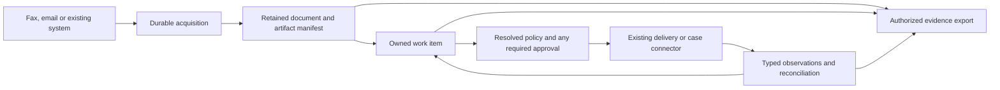

# Enterprise correspondence: future architecture and implementation guidance

**Maintained source:** this file lives outside the generated documentation tree. See [planning ownership](README.md) for generator boundaries.

**Status: proposed future work, documented October 3, 2026.** This design folds the correspondence research into Faxbot's normal direction. It does not expand the current Phase 1 implementation or the four-fix batch for destination normalization, TXT pagination, client idempotency, and one-bit PDF images. The [README roadmap](../README.md#roadmap) owns implementation status. Stage labels below describe dependencies, not separate delivery commitments.

Code observations refer to checkout `d0b77d61` on `feat/faxbot-refresh`; they are inspection findings, not new runtime or production verification. Re-check the relevant code before implementing. The [refresh design](../docs/architecture/2026-10-02-faxbot-refresh-design.md), [durable outbound design](../docs/architecture/2026-10-02-faxbot-durable-outbound.md), and [configuration design](../docs/architecture/2026-10-02-faxbot-configuration-activation.md) remain in force.

The product should help an organization receive a document, get it to an accountable person, complete the required action, and retain evidence of what happened. Shared infrastructure must work across companies and industries. Customer names, presumed incumbent systems, and employer-specific rules do not belong in product defaults. Individual integrations and applicability decisions follow later.

## 1. Core enterprise capabilities

### Current foundations and gaps

“Implemented” below identifies existing building blocks; it does not certify an end-to-end regulated workflow. “Partial” identifies a usable foundation with missing enterprise behavior. Every proposed interface later in this document is new design, not an available API.

| Capability | Current status and evidence | Gap and extension point |
| --- | --- | --- |
| Provider flexibility and delivery | Implemented: independent inbound/outbound configuration, captured provider identity, durable outbound attempts, reconciliation and cost routing. See [configuration](../api/app/config_store.py), [outbound store](../api/app/outbound_store.py), [routing](../api/app/routing). | Preserve these boundaries. Apply permitted-channel/account policy before ranking eligible routes by cost; a cheaper route cannot override recipient or workflow requirements. |
| Identity and document access | Implemented: local users, groups, roles, keys, sessions and mailbox/document grants in [access](../api/app/access). | Workforce federation and provisioning are proposed. The current resource tree has installation, personal/mailbox and fax resources; organizational policy scopes are not tenant isolation. |
| Document acquisition and routing | Partial: inbound mailbox routing in [access/inbound.py](../api/app/access/inbound.py); ordinary/direct deliveries feed [intake/store.py](../api/app/intake/store.py). | Durable acquisition needs repair/verification: some [main.py](../api/app/main.py) callbacks consume deduplication before fetching and create placeholders on fetch failure. Add source provenance and an import contract; never expose a placeholder as a received document. |
| Email and incumbent-system intake | Partial: SMTP **output** and retry/review behavior exist in [intake/worker.py](../api/app/intake/worker.py) and [schema_delivery.py](../api/app/schema_delivery.py). | Email ingestion, generic incumbent fax import, watched folders and case-system connectors are proposed. Current [intake HTTP](../api/app/intake/http.py) is installation-wide; it is not yet a restricted team work queue. |
| Ownership, deadlines, acknowledgements | Proposed. Transport and SMTP statuses supply observations, not accountable business ownership. | Add durable work items, assignment, acknowledgement, deadline calculation and escalation above intake; scope lists, counts, search and exports as well as individual reads. |
| Approvals and verified recipients | Partial: [direct/service.py](../api/app/direct/service.py) proves an enrolled key/number relationship; case packets require an administrator-configured recipient opt-in to reference earlier material. | Recording evidence of that consent is proposed. Number possession does not establish authority over a legal entity, department or purpose. Add recipient profiles and exact-action release approvals across every client. |
| Case-document reuse | Implemented: [cases/ledger.py](../api/app/cases/ledger.py) and packet preparation track fax-success-based accepted documents. | This is not general case management or business acceptance. Preserve existing semantics; introduce separate acknowledgement and case-system evidence. |
| Evidence exports | Partial: artifact hashes, attempt records, direct receipts and persistent access audit exist. | Add a permission-scoped export. Preserve provider-native evidence where available; current telephony callbacks/status storage do not retain every reported field. General audit configuration is not a complete durable evidence ledger. |
| Retention and legal holds | Partial: age-based cleanup exists in [main.py](../api/app/main.py). Legal holds and a common disposition authority are proposed. | Inbound cleanup can clear a PDF reference despite deletion failure; direct artifacts and local/cloud copies need coordinated coverage. Map [storage.py](../api/app/storage.py), direct storage and every cleanup path before claiming retention enforcement. |
| Controlled AI processing | Proposed: MCP exposes authorized fax tools, not a governed OCR/extraction pipeline. | Add approved endpoint policy, minimal data release, source attribution, review and versioned processing evidence. Existing MCP identity mapping is not workforce SSO. |
| Guided enterprise setup | Partial: [SetupWizard.tsx](../api/admin_ui/src/components/SetupWizard.tsx) configures providers and basic security. | Add operating-context questions, policy suggestions, scope preview, conflicts and readiness checks through existing configuration activation. |

### Deployment and authorization boundary

Keep a dedicated installation per operating organization as the supported trust model. Legal entities, facilities and operating jurisdictions are business and policy context within that installation. Do not advertise hosted isolation for unrelated organizations without a separate tenant model and migration. Preserve independent inbound and outbound providers, existing numbers, immutable attempt/account bindings and capability checks.

Build on existing principals, groups, permissions and mailbox/document resources. A workflow's policy cannot grant document access. Extending resource kinds or organization/workflow scopes needs additive schema and authorization work, including connector accounts, assignment, search, counts, exports, subscriptions and AI inputs. A person eligible for assignment must also have the required access; assignment alone must not confer it. Changing or disabling an owner exposes work for authorized reassignment instead of hiding it.

### Proposed records and interfaces

These are logical module boundaries inside the existing modular monolith. Final module names, HTTP routes and migrations are implementation decisions. Keep acquisition, work management, policy and disposition separate from provider adapters; do not turn the intake row or cost ledger into a second business database.

**Acquisition — `ImportPort.accept(envelope)` and `acquire(import_id)`.** An envelope records connector/account/direction, external operation ID and revision, source-reported receipt time and its provenance, import time, destination, sender claims, reported outcome and available original report. Treat mailbox hints and external identifiers as untrusted inputs. Persist the event before fetching; retain pending/retryable/quarantined states. Authenticate events, bound downloads and parsing, and restrict network destinations. A completed record requires a positively validated, durably stored artifact, not a PDF prefix or provider success flag.

An identical replay of the same source identity resumes or returns its existing import. Changed content under the same immutable source revision produces a conflict for reconciliation; a declared new source revision creates a related version. Equal bytes from distinct business events remain distinct records. Missing or uncertain source time remains unknown; it must not silently become the import time.

**Documents — `DocumentRecord` and `ArtifactManifest`.** Record the authentic received bytes, media type, digest, storage profile/object version, access resource, source identity and immutable derivation links. Store fax renditions, previews, OCR and generated packets as separate artifacts. “Original” means the artifact actually acquired: ordinary fax commonly supplies a received raster, not the sender's original PDF. Document identity, business operation identity, transport attempt identity and content digest have separate meanings. Shared physical storage must not merge permissions or retention obligations.

**Work management — `WorkItem.transition(expected_version, event)`.** A work item references documents, mailbox, workflow/purpose, responsible team, owner, backup/escalation destination, applied policy revision and optional external case reference. Persist assignment history and optimistic concurrency. Distinguish `transport_delivered`, `mailbox_imported`, `owner_acknowledged`, `action_submitted` and `action_confirmed`, with an actor/source, timestamp and evidence reference for each. Receiving, reading, acknowledging responsibility and completing an action are different events. An SMTP server accepting mail does not prove a staff member saw it. Current case-ledger “accepted” remains transport-based and cannot populate business acknowledgement automatically.

**Deadlines — `DeadlinePolicy.calculate(trigger, context, revision)`.** Specify the trigger event, evidence, timezone, calendar version, duration/counting convention, applicable pauses and due-time precision. An operational acknowledgement target must be labeled separately from a sourced legal requirement. Rules triggered by awareness, complete receipt or a later external notice cannot all start at import time. Preserve corrected/late trigger evidence and recalculate with an audit trail; duplicates and restarts never reset the clock. “Immediate attention” is an explicit urgency rule, not an invented zero-day statutory deadline. Durable escalation uses stable event identity and records missing acknowledgements without asserting failure of the underlying transport.

**Recipient policy — `RecipientDirectory.resolve(purpose, destination, revision)`.** A profile binds a legal entity and intended department/queue to approved destinations, purposes, permitted channels and sending identities. Record verification method/source, reviewer, date, expiry and revocation for each claim. Distinguish number/key control from independently established organization/queue authority and from acceptance of a particular filing channel. A fax number on a website is insufficient to authorize every document type. A portal-only action may produce a prepared packet and a manual submission task with an external receipt requirement; Faxbot must not silently substitute fax or email.

**Approvals — `ApprovalService.authorize(action_envelope)` and dispatch revalidation.** Bind a grant to final artifact-manifest digest and order, cover sheet, referenced case documents, resolved recipients/destinations and versions, sending legal entity, purpose, policy decision, reviewer authority, expiry and allowed channel/provider-account envelope. Keep internal release approval, recipient consent to packet references and recipient acknowledgement distinct. Approvers cannot approve beyond their access or role; configurable separation of duties must be server-enforced.

The approved manifest includes the final packet and any precomputed, validated transmission renditions, each with its digest and derivation link. A route requiring another rendition must prepare it and obtain a new approval before release. Changes to approved content, recipients, destination ownership, purpose or required controls invalidate the grant. Permit retries within the explicitly approved route/artifact envelope without requiring approval for each eligible cost-ranked route; each actual attempt still captures its own immutable provider and rendition. Authorization/approval reservation and attempt creation must be atomic and bound to the stable logical action, so worker retries do not create a second release.

For protected workflows requiring continuing release authorization, define which submitter and approver authorities must remain valid at dispatch; their revocation or policy tightening blocks an unsubmitted action and records the reason. The worker's service identity does not substitute for these grants. This additional workflow rule must not silently change the captured background authority of ordinary accepted fax jobs in [access/outbound.py](../api/app/access/outbound.py). Receipt processing and reconciliation continue under the existing service authority after human access is revoked. If an earlier submission may have taken effect, reconcile it before any new external action. Approval cannot revoke bytes already submitted.

**Evidence — `EvidenceExport.create(scope, snapshot_revision)`.** Export authorized originals and derivatives, a file/digest manifest, source/acquisition reports, transport observations, ownership/deadline history, approvals, applied policy/template revisions and supplied external acknowledgements. Name missing evidence and unavailable provider fields explicitly. Capture source meaning: provider acceptance, protocol completion, direct spool receipt and case-system import have different evidentiary value. Preserve useful native fields plus normalized values without credentials or unrelated personal records. A hash detects changes; it does not certify authorship, legal admissibility or an independent timestamp.

Enforce access at export creation and retrieval, including revocation and expiry; record the snapshot and export itself. Define the access policy for historical evidence and redactions without modifying the retained original. An export is another retained artifact with its own applicable disposition controls. Do not invent page-level acknowledgements when the provider exposes only aggregate status.

**Retention and holds — `DispositionCoordinator.evaluate(record)` / `hold(scope)` / `purge(claim)`.** Resolve record class, trigger, retention minimum/maximum, legal holds, dependencies and every managed copy: local staging, cloud object versions, direct storage, derivatives, exports and separately classified audit/receipt metadata. No single global age setting can represent these policies. All destructive cleanup paths must use one durable disposition authority; do not bolt a hold check onto only the normal PDF path.

Define an atomic boundary between accepting a hold and authorizing irreversible deletion. A successful hold acknowledgement must protect the applicable copies; a purge already beyond that boundary returns an explicit conflict or qualified outcome, never false protection. Holds have scope, reason, authorized issuer/releaser and audited release. Deletion records each target/version, result and retry state; clear a live artifact reference only after confirmed removal. Cover crash recovery, partial-copy failures and shared artifacts. Backups and external email/case-system copies have explicit capabilities and limits, not an assumed deletion guarantee. Restore procedures reapply holds and disposition records before making restored artifacts available.

**Corporate identity — `WorkforceIdentity.map(issuer, subject)` and provisioning events.** Map a verified external subject to existing principals and explicitly approved group-to-role/resource assignments. Do not identify a person by an unverified email claim or give all organization members document access. Record provisioning changes, deactivation, session/delegated-key revocation and break-glass administration. Choose federation/provisioning protocols and providers when implementing the narrow supported integration. MCP issuer/subject mapping to an API key does not satisfy this workforce lifecycle.

**Controlled processing — `ExtractionService.propose(document, policy_revision)`.** Permit OCR/classification/extraction only through configured endpoints allowed for the document's purpose, processing location and data-handling policy. Local processing can be one option; it is not an assumed universal requirement. Capture model/tool/prompt version, input artifact references, source pages/regions, uncertainty, output and review status. Minimize transmitted material and apply authorization to retrieval, processing and retained outputs. Document text is untrusted content, never an instruction to change permissions or perform actions. Extracted names, dates or identifiers are proposals requiring the configured review; they cannot automatically establish a person's identity, invent an acknowledgement, approve release or carry out a consequential action.

**Connections — `ConnectorPort.accept / submit / reconcile / observe`.** Declare supported directions, formats, account identity, authentication, idempotency scope, receipt meanings and uncertain-outcome behavior. Reuse existing fax delivery paths. Distinguish email ingestion from existing SMTP output. A first generic import can consume a synthetic file plus metadata manifest; an adapter later maps an incumbent fax service, watched folder or approved mailbox to that contract. Case-system integrations must map stable external references and actual acknowledgement evidence, not treat HTTP acceptance as successful filing. External side effects need idempotency or explicit reconciliation. Recipient-facing forms, clinical/case schemas and vendor mappings belong in optional adapters, not the core fax model.

## 2. Configurable requirements and optional templates

### Template contract

Templates are optional, versioned starting points. A jurisdiction label alone cannot establish applicability. Core records and controls remain neutral; forms, fields, terminology, document checklists and specialized rules belong in templates or integrations. Use declarative settings against supported capabilities rather than arbitrary executable code embedded in a template.

| Template field | Required content |
| --- | --- |
| Identity and lifecycle | Stable ID, immutable version, author/reviewer, draft/reviewed/withdrawn state, effective and review dates, superseded version and change summary. |
| Applicable scope | Country and narrower jurisdiction where relevant; entity/role, industry, document purpose, recipient and channel; inclusion criteria, exclusions and applicability questions. |
| Sources | Authoritative title, issuer, URL/reference, precise rule supported, publication/effective dates if known, date checked, source snapshot/reference where permitted, reviewer and uncertainty. Distinguish law, recipient instructions, contract and organization policy. |
| Required settings | Required capabilities and decisions: channel, verified recipient/sender, ownership, trigger/calendar/timezone, access, approvals, evidence, retention/holds, processing endpoints and local overrides. Unknown values stay unresolved. |
| Evidence requirements | What proves each required event; artifact/receipt types, source/time provenance, missing-evidence behavior and export checklist. |
| Coverage and limits | Exactly which steps/rules are supported, excluded or manual; what the organization must configure, verify or perform elsewhere, with named local responsibility. No blanket compliance badge. |
| Activation record | Approved applicability, resolved values and provenance, supporting capability checks, local approving authority, applied revision and unresolved warnings. Required unresolved controls block affected operations. |

Start with generic correspondence and document-specific template families useful in the UK, Australia and US, particularly healthcare and other regulated organizations. These priorities are product direction, not claims about current law. The existing research has scoped US healthcare references and general workflow evidence; it does not establish a complete US policy or verified UK/Australian healthcare rules. Regional examples remain inactive drafts until their sources and applicability are reviewed. Do not invent deadline counts, retention durations or authorized channels from the earlier discussion.

| Optional example family | Reusable core | Template/integration content and outstanding decisions |
| --- | --- | --- |
| UK healthcare correspondence | Intake, owned work, recipient verification, evidence and retention controls | Referral/records-request fields and terminology; applicable organization/role, recipient channel instructions, access/approval rules and reviewed sources. |
| Australian healthcare correspondence | The same core | State/territory and entity applicability where relevant, local forms, recipient requirements, deadline triggers, data handling and source-backed retention settings. |
| US healthcare correspondence | The same core | Entity/role and state applicability where relevant, permitted recipients/channels, required agreements/processes, evidence and approved processing settings. Existing healthcare research is only a starting source set. |
| Claims, complaints, licensing or restricted disclosures | The same core | Purpose-specific packet checklist, due-event semantics, release authority, contact restrictions, portal/case-system mappings and external confirmation requirements. |
| General organizational correspondence | The same core | Locally chosen acknowledgement targets, team routing and evidence checklist, explicitly labeled operational policy. |

Do not ship fictional legal examples as live rules. A synthetic operational template can be exercised before any industry template is complete. A form's presence does not prove its content is complete or the channel is permitted. Restricted-recipient or contact rules are purpose-specific and do not automatically modify unrelated customer communications in another system.

### Policy resolution and scope

`PolicyResolver.resolve(context, revision_set)` returns an effective decision, its per-setting provenance and any unresolved requirements. Capture organization defaults, mailbox settings and workflow settings. The workflow may use document purpose, operating entity and recipient context; staff should inherit reviewed settings rather than interpret jurisdiction rules during every send. Unclassified input enters a restricted triage state with an authorized owner, without losing the inbound document.

Specify merge rules per setting:

- Organization defaults can be refined by mailbox and workflow only where overrides are allowed. Mandatory parent controls cannot be silently weakened by a child template.
- Allowed channels and recipients narrow through applicable constraints. An empty intersection is a conflict; price routing cannot select outside it. Permissions remain an independent authorization check.
- Minimum retention, maximum retention, trigger events and holds have distinct meanings. Neither “most specific wins” nor “take the longest period” resolves every conflict. Incompatible obligations require a recorded authorized decision; they cannot be saved as a false compliant setting.
- Deadline policies retain separate obligations when their triggers or responsible actions differ. Resolve incompatible calendars/triggers explicitly rather than silently choosing the shortest number.
- Evidence and approval requirements compose only through documented rules. Missing capabilities, identity controls or processing approvals prevent activation of the affected protected workflow.

The same captured context and revisions must reproduce a decision. Pin the decision to each work item and release envelope. A new template version creates a reviewable migration/diff, never a silent rewrite of historical actions. Define review and revalidation for open work, tightened controls and source withdrawal; preserve the previous decision and reason for changes. A blocked outbound action must not prevent safe receipt or conceal an incoming item.

## 3. Guided setup

Extend the current wizard with `SetupPlan.preview(context)` and `apply(plan_id, expected_revision)`, using the existing configuration validation/activation path. This is proposed design, not an existing onboarding feature.

1. **Describe the organization and work.** Ask for operating jurisdictions/facilities, relevant entity/industry roles, document types and purposes, responsible teams, existing fax/email/case systems and identity/processing boundaries. Collect only facts needed for suggestions; do not presume a particular employer or require replacing a working provider.
2. **Suggest a small configuration.** Recommend available generic workflows or reviewed template versions, explain each suggestion and source, and label any unsupported or uncertain applicability. Show how incoming documents reach staff and where completion is recorded.
3. **Preview effective settings.** Display organization, mailbox and workflow values, inheritance, permitted overrides, approved channels, deadline triggers, evidence obligations and retention/hold behavior. Preserve separate inbound/outbound providers. Changing a policy must not silently replace providers or redirect accepted jobs.
4. **Show what is missing.** Maintain a visible list of missing source review, recipient verification, queue ownership, calendar/trigger, approval role, retention decision, identity prerequisite, connector capability or processing permission. Each item has an owner, affected operation and blocking/warning status. Distinguish product gaps from choices the organization still needs to make.
5. **Validate and apply deliberately.** Preview sends no messages and starts no external actions. Applying a reviewed plan uses a versioned configuration/policy diff, checks current authority and rejects stale revisions. Report saved versus active settings and any required restart. Required unresolved controls keep the affected workflow inactive; generic safe intake can remain available.
6. **Guide daily work through exceptions.** Staff see their assigned work, allowed actions, due-time explanation and any missing information. They do not repeatedly choose a regulatory mode. Ambiguous routing, extracted data or unsupported channels go to the configured reviewer. Administrators can inspect why a decision was made and what changes would affect open work.

For example, an administrator could configure two mailboxes with different operating jurisdictions and document purposes under the same installation. Setup must display each mailbox's effective choices and unresolved template sources independently; it must not apply one country's presumed rules to every workflow. A draft healthcare template can remain inactive while a synthetic generic workflow is evaluated. “Ready” means its configured technical prerequisites pass, not legal certification.

## Implementation sequence and acceptance criteria

**Testing boundary:** all acceptance criteria below are exercised with synthetic data, mocks and local test services. We cannot perform real customer enterprise end-to-end acceptance ourselves, and it is not required for CI, merge, release or completion of a generic capability. Live customer validation is separate, opt-in work; missing access or credentials is not a project blocker. Follow the [enterprise testing policy](../CONTRIBUTING.md#enterprise-testing-boundary). Deployment-specific controls and template applicability checks below do not create repository CI gates.

The smallest useful foundation is **E0 plus E1**: one trustworthy import, an owned queue, an acknowledgement target and an evidence export. Do not require a new fax carrier, a case-system replacement, a large template catalog or AI to demonstrate it. Conversely, a control required for the selected real workflow must be available before using its records, regardless of stage number. Synthetic evaluation can precede workforce federation; a real workflow that requires SSO or legal holds cannot.

| Stage | Proposed scope and code seam | Acceptance criteria |
| --- | --- | --- |
| E0: trustworthy acquisition | Repair/verify callback acquisition in `main.py`; use existing inbound resource creation and intake entry points; add immutable source/artifact provenance. | A fetch failure followed by restart and notification replay resumes the same import and produces one authentic retained document after recovery. Unauthenticated/invalid events cannot create imports or trigger retrieval. Equal provider IDs in distinct accounts remain distinct. Invalid/missing bytes never become a completed receipt. Preserve source time separately from import time and distinguish conflicting revisions. |
| E1: useful foundation | Generic import adapter, additive work-item/events schema, mailbox-scoped ownership, acknowledgement target and export. Build over access/intake, not the transport cost ledger. | Synthetic normal, duplicate, missing-artifact and unacknowledged inputs show correct owner/state; concurrent assignment cannot lose changes. Deadlines survive restart and late events; repeated escalation has one effect. Denied list/count/export requests disclose no restricted work. Export reproduces actual available evidence and declares missing receipts. |
| E2: protected workflows | Minimal shared policy resolver with revisions, per-setting provenance and conflict decisions; recipient directory and approvals at server dispatch; disposition coordinator covers storage and every cleanup path. | Changed content/recipient or an unapproved rendition invalidates approval; a denied API/SDK/MCP call cannot bypass review. Approved route alternatives preserve attempt identity; uncertain submissions still reconcile after human revocation. Replaying a pinned policy decision is deterministic. Hold-versus-purge race, crash, failed-copy deletion and restore cases retain truthful protection/deletion state. |
| E3: templates and setup | Versioned declarative templates using the E2 resolver; extend wizard/config validation/activation. | UK/AU/US draft examples remain inactive without required sources and applicability. Preview explains inherited settings, conflicts and missing controls; stale apply fails. A version update produces a diff without rewriting historical evidence. Staff use inherited settings. |
| E4: enterprise integrations | Workforce identity/provisioning, approved OCR/AI and a supported case-system adapter through the same contracts. | Deprovisioning revokes sessions/delegated access and exports as designed. AI returns attributed proposals, cannot approve itself and cannot use a disallowed endpoint. Lost external acknowledgements reconcile without duplicate actions; displayed completion reflects the actual case-system receipt. |

Before each stage, inspect the current checkout and reuse completed work rather than rebuilding it from the dated research. Use additive migrations and existing frozen-schema conventions. Keep public fax contracts and current provider flexibility intact. Passing the applicable synthetic/local checks is sufficient software acceptance; record real integrations as not live-validated where applicable. Handling-time and financial measurements belong to a later customer evaluation and are not release gates.

## Deferred integration and customer decisions

These are discovery inputs for a future pilot, not blockers to this architecture update and not assumptions about any employer.

| Decision | Evidence needed before the relevant feature is activated |
| --- | --- |
| First ingress and system of record | Supported export/API/mailbox contract, authentic sample metadata, stable IDs, available original artifacts and authoritative external case reference. |
| Responsibility and completion | Queue owner/backup, acknowledgement meaning, action-confirmation evidence, deadline trigger/calendar and escalation authority. |
| Recipient and permitted channel | Entity/department authority, approved purpose/sending identity, channel instructions, number/key lifecycle and any required manual portal step. |
| Applicable rules and templates | Reviewed authoritative sources, exact organizational/jurisdiction scope, agreements/policies and an accountable local approver. |
| Access, identity and processing | Role/resource mappings, federation/provisioning needs, approved endpoints, data location/handling and review requirements. |
| Retention, holds and recovery | Record classes/triggers, applicable periods, hold/release authority, all copy locations, backup behavior and external deletion limits. |
| Operational fit | Volumes, exception rates, interface/support costs and a measurable benefit compared with the current process. |

## Research provenance and maintenance

This design generalizes the earlier workplace discussion into reusable capabilities; raw customer hypotheses are not product requirements. The local [research package](../research/faxbot-cost-research-2026-10-03/README.md), [enterprise addendum](../research/faxbot-cost-research-2026-10-03/ADDENDUM_2026-10-03.md#8-future-enterprise-correspondence-work), [healthcare memo](../research/faxbot-cost-research-2026-10-03/research/05_healthcare_workflows_security_and_prior_art.md), [evidence memo](../research/faxbot-cost-research-2026-10-03/research/07_evidence_ledger_and_experimental_ideas.md) and [failure-mode review](../research/faxbot-cost-research-2026-10-03/research/08_design_review_and_failure_modes.md) preserve the supporting context. The research bundle is intentionally local and excluded from Git; this repository architecture is self-contained so a clean clone does not depend on those optional files.

No new external legal research was performed for this documentation update. Existing source dates and uncertainties remain in force. Any executable legal or industry rule needs current authoritative verification and applicability review before activation. Keep the README and its roadmap, this architecture and affected operator/API/client guidance current in the same change as a capability lands; do not mark a proposed module implemented merely because its interface is documented.
