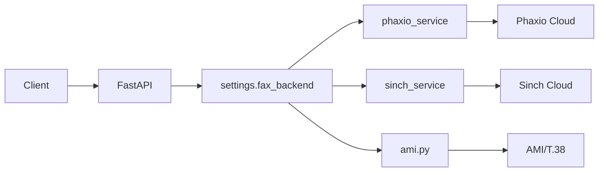
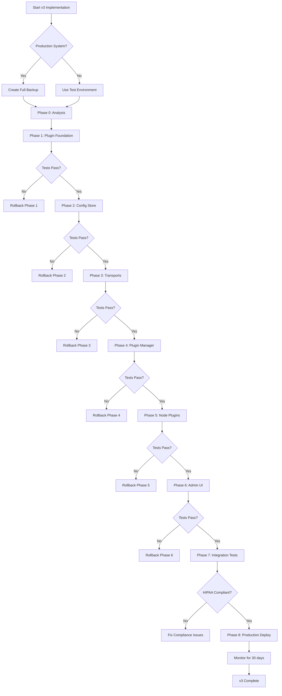

# Faxbot v3 Plugin Architecture - Implementation Guide

## CRITICAL PRODUCTION NOTICE
This is a HIPAA-compliant production system with active Business Associate Agreements (BAAs) processing Protected Health Information (PHI). Multi-million dollar fines are at stake. Every change MUST maintain compliance, audit trails, and PHI security.

## Current State Analysis (Reality)

### What Exists Today
1. **Backend Selection**: Environment variable `FAX_BACKEND` = `phaxio` | `sinch` | `sip`
2. **Provider Services**: 
   - `phaxio_service.py` - Phaxio cloud fax with tokenized PDF URLs
   - `sinch_service.py` - Sinch direct upload API
   - `ami.py` - Asterisk AMI for SIP/T.38 fax
3. **Storage**: `storage.py` with Local and S3 backends (PHI-compliant with KMS)
4. **MCP Servers**: 
   - Node: stdio/HTTP/SSE in `node_mcp/`
   - Python: stdio/SSE in `python_mcp/`
5. **Admin Console**: React UI in `api/admin_ui/`
6. **Auth**: Multi-key system with scopes (`fax:send`, `fax:read`, `inbound:*`)

### Critical HIPAA Controls in Place
- HMAC webhook verification (Phaxio/Sinch)
- Tokenized PDF access with TTL
- Audit logging (never logs PHI content)
- S3 SSE-KMS encryption
- API key scoping
- HTTPS enforcement for production

## v3 Architecture Goals

### Two Independent Plugin Systems
1. **Python Plugin System** (Backend execution)
   - Handles actual fax transmission
   - Storage backends
   - Authentication providers
   - Runs in FastAPI process

2. **Node Plugin System** (MCP/UI helpers)
   - MCP tool enhancements
   - UI helper functions
   - Client-side validations
   - NO direct PHI handling

## Implementation Phases

### Phase 0: Complete Analysis & Planning (Week 1)

#### 0.1 Map Current Dependencies
```python
# Files to analyze completely:
- api/app/main.py          # Provider dispatch logic (lines 1596-1641)
- api/app/config.py         # Settings and env vars
- api/app/phaxio_service.py # Complete Phaxio implementation
- api/app/sinch_service.py  # Complete Sinch implementation
- api/app/ami.py            # Complete SIP/Asterisk
- api/app/storage.py        # Storage abstraction
- api/app/auth.py           # Multi-key auth system
- api/app/audit.py          # Audit logging (PHI-safe)
```

#### 0.2 Document Current Flows


#### 0.3 HIPAA Impact Analysis
- [ ] Map all PHI touch points
- [ ] Document audit trail requirements
- [ ] Identify encryption boundaries
- [ ] Review BAA requirements for plugins

### Phase 1: Python Plugin Foundation - DETAILED EXECUTION PLAN

**CRITICAL**: This is a HIPAA production system. Every step must maintain PHI security.

#### Phase 1.0: Pre-Flight Checks (15 minutes)

##### Step 1.0.1: Verify Current System Health
```bash
# Agent Instruction: Run these commands and verify all pass
curl -X GET http://localhost:8080/health
# Expected: {"status": "healthy", ...}

curl -X GET http://localhost:8080/fax/test-job-id
# Expected: 404 or actual job status

# Check env vars are set
python3 -c "import os; assert os.getenv('FAX_BACKEND') in ['phaxio','sinch','sip']; print('Backend:', os.getenv('FAX_BACKEND'))"
```

##### Step 1.0.2: Create Backup Point
```bash
# Agent Instruction: Create timestamped backup
BACKUP_TIME=$(date +%Y%m%d_%H%M%S)
mkdir -p backups/v3_phase1_${BACKUP_TIME}
cp -r faxbot/api/app backups/v3_phase1_${BACKUP_TIME}/
cp faxbot/api/requirements.txt backups/v3_phase1_${BACKUP_TIME}/
echo "Backup created: backups/v3_phase1_${BACKUP_TIME}"
```

##### Step 1.0.3: Verify Git State
```bash
# Agent Instruction: Ensure we can rollback
cd faxbot
git status
git add -A
git commit -m "v3 Phase 1: Pre-implementation checkpoint"
git tag v3-phase1-start
```

#### Phase 1.1: Create Plugin Directory Structure (30 minutes)

##### Step 1.1.1: Create Base Directory
```bash
# Agent Instruction: Create plugin directory structure
mkdir -p faxbot/api/app/plugins
mkdir -p faxbot/api/app/plugins/base
mkdir -p faxbot/api/app/plugins/adapters
mkdir -p faxbot/api/app/plugins/registry
touch faxbot/api/app/plugins/__init__.py
touch faxbot/api/app/plugins/base/__init__.py
touch faxbot/api/app/plugins/adapters/__init__.py
touch faxbot/api/app/plugins/registry/__init__.py
```

##### Step 1.1.2: Create Plugin Base Types
```python
# Agent Instruction: Create faxbot/api/app/plugins/base/types.py
"""Plugin type definitions - HIPAA-compliant"""
from dataclasses import dataclass
from typing import Dict, Any, Optional, List
from datetime import datetime

@dataclass
class SendResult:
    """Result from sending a fax - NO PHI"""
    job_id: str
    backend: str
    provider_sid: Optional[str] = None
    accepted: bool = True
    queued_at: Optional[datetime] = None
    
    def to_dict(self) -> Dict[str, Any]:
        """Serialize for JSON - HIPAA safe"""
        return {
            'job_id': self.job_id,
            'backend': self.backend,
            'provider_sid': self.provider_sid,
            'accepted': self.accepted,
            'queued_at': self.queued_at.isoformat() if self.queued_at else None
        }

@dataclass
class StatusResult:
    """Fax transmission status - NO PHI"""
    job_id: str
    status: str  # queued|in_progress|SUCCESS|FAILED
    pages: Optional[int] = None
    error: Optional[str] = None  # Generic error, no PHI
    updated_at: Optional[datetime] = None
    
    def to_dict(self) -> Dict[str, Any]:
        """Serialize for JSON - HIPAA safe"""
        return {
            'job_id': self.job_id,
            'status': self.status,
            'pages': self.pages,
            'error': self.error,
            'updated_at': self.updated_at.isoformat() if self.updated_at else None
        }

@dataclass
class PluginManifest:
    """Plugin metadata - public info only"""
    id: str
    name: str
    version: str
    categories: List[str]  # ['outbound', 'inbound', 'storage', 'auth']
    capabilities: List[str]  # ['send', 'get_status', 'webhook']
    description: Optional[str] = None
    author: Optional[str] = None
    license: Optional[str] = None
    config_schema: Optional[Dict[str, Any]] = None
    
    def to_dict(self) -> Dict[str, Any]:
        return {
            'id': self.id,
            'name': self.name,
            'version': self.version,
            'categories': self.categories,
            'capabilities': self.capabilities,
            'description': self.description,
            'author': self.author,
            'license': self.license,
            'config_schema': self.config_schema
        }
```

##### Smoke Test 1.1.2:
```python
# Agent Instruction: Run this test
# Save as faxbot/api/tests/test_plugin_types.py
import sys
sys.path.insert(0, '/path/to/faxbot/api')
from app.plugins.base.types import SendResult, StatusResult, PluginManifest
from datetime import datetime

# Test SendResult
result = SendResult(
    job_id="test-123",
    backend="phaxio",
    provider_sid="phaxio-456",
    queued_at=datetime.utcnow()
)
assert result.to_dict()['job_id'] == "test-123"
assert 'queued_at' in result.to_dict()
print("✓ SendResult works")

# Test StatusResult  
status = StatusResult(
    job_id="test-123",
    status="SUCCESS",
    pages=3
)
assert status.to_dict()['status'] == "SUCCESS"
assert status.to_dict()['pages'] == 3
print("✓ StatusResult works")

# Test PluginManifest
manifest = PluginManifest(
    id="faxbot-phaxio",
    name="Phaxio Cloud Fax",
    version="1.0.0",
    categories=["outbound"],
    capabilities=["send", "get_status", "webhook"]
)
assert manifest.to_dict()['id'] == "faxbot-phaxio"
assert "webhook" in manifest.capabilities
print("✓ PluginManifest works")

print("\n✅ All type tests passed!")
```

##### Step 1.1.3: Create Plugin Dependencies
```python
# Agent Instruction: Create faxbot/api/app/plugins/base/deps.py
"""Plugin dependency injection - HIPAA-compliant"""
from dataclasses import dataclass
from typing import Callable, Any, Optional
import logging
import httpx
from pathlib import Path

@dataclass
class PluginDeps:
    """Dependencies injected into plugins - NO PHI in logs"""
    
    # Core dependencies
    logger: logging.Logger
    db: Callable  # Returns DB session
    http: httpx.AsyncClient
    
    # Storage and config
    storage: Any  # Storage backend instance
    config_dir: Path  # Plugin-specific config directory
    
    # Events and monitoring
    audit: Callable[[str, dict], None]  # Audit function (event_type, metadata)
    events: Optional[Any] = None  # Event bus for pub/sub
    metrics: Optional[Any] = None  # Metrics collector
    cache: Optional[Any] = None  # Cache backend
    
    # Security
    encrypt: Optional[Callable[[bytes], bytes]] = None  # Encryption function
    decrypt: Optional[Callable[[bytes], bytes]] = None  # Decryption function
    
    def audit_event(self, event_type: str, **kwargs):
        """Audit an event - NEVER include PHI"""
        # Filter out any potential PHI fields
        safe_fields = ['plugin_id', 'job_id', 'status', 'backend', 'error_code']
        metadata = {k: v for k, v in kwargs.items() if k in safe_fields}
        self.audit(event_type, metadata)
    
    def get_config_path(self, filename: str) -> Path:
        """Get path to plugin config file"""
        return self.config_dir / filename
    
    def log_info(self, message: str, **kwargs):
        """Log info - NO PHI"""
        # Filter kwargs for safety
        safe_kwargs = {k: v for k, v in kwargs.items() 
                      if not any(phi in k.lower() for phi in ['ssn', 'dob', 'name', 'address'])}
        self.logger.info(message, extra=safe_kwargs)
    
    def log_error(self, message: str, **kwargs):
        """Log error - NO PHI"""
        safe_kwargs = {k: v for k, v in kwargs.items() 
                      if not any(phi in k.lower() for phi in ['ssn', 'dob', 'name', 'address'])}
        self.logger.error(message, extra=safe_kwargs)
```

##### Smoke Test 1.1.3:
```python
# Agent Instruction: Run this test
# Save as faxbot/api/tests/test_plugin_deps.py
import sys
sys.path.insert(0, '/path/to/faxbot/api')
from app.plugins.base.deps import PluginDeps
from pathlib import Path
import logging

# Mock dependencies
logger = logging.getLogger("test")
audit_calls = []

def mock_audit(event_type, metadata):
    audit_calls.append((event_type, metadata))

def mock_db():
    return "mock_session"

# Create deps
deps = PluginDeps(
    logger=logger,
    db=mock_db,
    http=None,  # Would be httpx.AsyncClient in real use
    storage=None,
    config_dir=Path("/tmp/test_config"),
    audit=mock_audit
)

# Test audit_event filters PHI
deps.audit_event("test_event", 
                 plugin_id="test",
                 job_id="123",
                 patient_name="SHOULD_BE_FILTERED",  # PHI - should be filtered
                 ssn="SHOULD_BE_FILTERED")  # PHI - should be filtered

assert len(audit_calls) == 1
event, metadata = audit_calls[0]
assert event == "test_event"
assert "plugin_id" in metadata
assert "job_id" in metadata
assert "patient_name" not in metadata  # PHI filtered
assert "ssn" not in metadata  # PHI filtered
print("✓ PluginDeps filters PHI from audit")

# Test config path
config_path = deps.get_config_path("settings.json")
assert str(config_path) == "/tmp/test_config/settings.json"
print("✓ Config path works")

print("\n✅ All dependency tests passed!")
```

##### Step 1.1.4: Create Plugin Base Interface
```python
# Agent Instruction: Create faxbot/api/app/plugins/base/interface.py
"""Plugin interface - HIPAA-compliant by design"""
from abc import ABC, abstractmethod
from typing import Dict, Any, Optional
from .types import SendResult, StatusResult, PluginManifest
from .deps import PluginDeps

class FaxPlugin(ABC):
    """Base plugin interface - MUST maintain HIPAA compliance"""
    
    def __init__(self):
        self.deps: Optional[PluginDeps] = None
        self.config: Dict[str, Any] = {}
        self.started: bool = False
    
    @abstractmethod
    def manifest(self) -> PluginManifest:
        """Return plugin metadata - NO PHI"""
        pass
    
    @abstractmethod
    def validate_config(self, config: Dict[str, Any]) -> None:
        """Validate configuration, raise ValueError if invalid
        
        MUST NOT log sensitive credentials or PHI
        """
        pass
    
    def start(self, config: Dict[str, Any], deps: PluginDeps) -> None:
        """Initialize plugin with dependencies
        
        Default implementation - override if needed
        """
        self.validate_config(config)
        self.config = config
        self.deps = deps
        self.started = True
        
        # Audit startup without sensitive data
        manifest = self.manifest()
        deps.audit_event("plugin_started", 
                        plugin_id=manifest.id,
                        version=manifest.version)
    
    def stop(self) -> None:
        """Cleanup on shutdown
        
        Default implementation - override if needed
        """
        if self.started and self.deps:
            manifest = self.manifest()
            self.deps.audit_event("plugin_stopped",
                                 plugin_id=manifest.id)
        self.started = False
        self.deps = None
        self.config = {}
    
    @abstractmethod
    async def send(self, to_number: str, file_path: str, 
                  options: Dict[str, Any] = {}) -> SendResult:
        """Send a fax
        
        Args:
            to_number: E.164 formatted phone number
            file_path: Path to PDF/TIFF file
            options: Provider-specific options
            
        Returns:
            SendResult with job info (NO PHI)
            
        CRITICAL: MUST NOT log file contents or full phone numbers
        """
        pass
    
    @abstractmethod
    async def get_status(self, job_id: str) -> StatusResult:
        """Get transmission status
        
        Args:
            job_id: Job identifier
            
        Returns:
            StatusResult with current status (NO PHI)
        """
        pass
    
    async def handle_webhook(self, headers: Dict[str, str], 
                           body: bytes) -> Dict[str, Any]:
        """Handle provider webhook - override if supported
        
        Args:
            headers: HTTP headers
            body: Raw request body
            
        Returns:
            Response data
            
        Default: Not implemented
        """
        raise NotImplementedError(f"Plugin {self.manifest().id} does not support webhooks")
    
    def get_capabilities(self) -> Dict[str, bool]:
        """Get plugin capabilities as feature flags"""
        manifest = self.manifest()
        return {
            'can_send': 'send' in manifest.capabilities,
            'can_get_status': 'get_status' in manifest.capabilities,
            'supports_webhooks': 'webhook' in manifest.capabilities,
            'supports_inbound': 'receive' in manifest.capabilities,
        }


class StoragePlugin(ABC):
    """Base interface for storage plugins"""
    
    @abstractmethod
    def manifest(self) -> PluginManifest:
        pass
    
    @abstractmethod
    async def store(self, key: str, data: bytes, metadata: Dict = {}) -> str:
        """Store data with optional encryption"""
        pass
    
    @abstractmethod
    async def retrieve(self, key: str) -> bytes:
        """Retrieve stored data"""
        pass
    
    @abstractmethod
    async def delete(self, key: str) -> bool:
        """Delete stored data"""
        pass


class AuthPlugin(ABC):
    """Base interface for auth plugins"""
    
    @abstractmethod
    def manifest(self) -> PluginManifest:
        pass
    
    @abstractmethod
    async def validate_token(self, token: str) -> Dict[str, Any]:
        """Validate auth token, return user info"""
        pass
    
    @abstractmethod
    async def create_token(self, user_id: str, scopes: list) -> str:
        """Create auth token"""
        pass
```

##### Smoke Test 1.1.4:
```python
# Agent Instruction: Run this test
# Save as faxbot/api/tests/test_plugin_interface.py
import sys
import asyncio
sys.path.insert(0, '/path/to/faxbot/api')
from app.plugins.base.interface import FaxPlugin
from app.plugins.base.types import SendResult, StatusResult, PluginManifest
from app.plugins.base.deps import PluginDeps

class TestPlugin(FaxPlugin):
    """Test implementation"""
    
    def manifest(self) -> PluginManifest:
        return PluginManifest(
            id="test-plugin",
            name="Test Plugin",
            version="1.0.0",
            categories=["outbound"],
            capabilities=["send", "get_status"]
        )
    
    def validate_config(self, config):
        if 'api_key' not in config:
            raise ValueError("Missing api_key")
    
    async def send(self, to_number, file_path, options={}):
        return SendResult(
            job_id=options.get('job_id', 'test-123'),
            backend='test',
            provider_sid='test-sid'
        )
    
    async def get_status(self, job_id):
        return StatusResult(
            job_id=job_id,
            status='SUCCESS',
            pages=1
        )

# Test the plugin
async def test():
    plugin = TestPlugin()
    
    # Test manifest
    manifest = plugin.manifest()
    assert manifest.id == "test-plugin"
    print("✓ Manifest works")
    
    # Test config validation
    try:
        plugin.validate_config({})
        assert False, "Should have raised"
    except ValueError as e:
        assert "api_key" in str(e)
        print("✓ Config validation works")
    
    # Test capabilities
    caps = plugin.get_capabilities()
    assert caps['can_send'] == True
    assert caps['can_get_status'] == True
    assert caps['supports_webhooks'] == False
    print("✓ Capabilities work")
    
    # Test send
    result = await plugin.send("+15551234567", "/tmp/test.pdf")
    assert result.job_id == "test-123"
    assert result.backend == "test"
    print("✓ Send works")
    
    # Test status
    status = await plugin.get_status("test-123")
    assert status.status == "SUCCESS"
    assert status.pages == 1
    print("✓ Get status works")
    
    print("\n✅ All interface tests passed!")

asyncio.run(test())
```

#### Phase 1.2: Feature Flag Implementation (20 minutes)

##### Step 1.2.1: Analyze Current Config
```python
# Agent Instruction: First READ the existing config.py
# Command: grep -n "class Settings" faxbot/api/app/config.py
# This will show where to add the feature flags
```

##### Step 1.2.2: Add Feature Flags to Settings
```python
# Agent Instruction: Add these lines to api/app/config.py Settings class
# Find the Settings class and add these fields

# In the Settings class, add:
    # V3 Plugin System Feature Flags
    feature_v3_plugins: bool = Field(
        default=False,
        description="Enable v3 plugin system (CAUTION: Production feature)"
    )
    
    feature_plugin_install: bool = Field(
        default=False,
        description="Allow remote plugin installation (SECURITY RISK - keep disabled for HIPAA)"
    )
    
    feature_plugin_registry: bool = Field(
        default=False,
        description="Enable plugin registry endpoints"
    )
    
    # Plugin configuration
    plugin_config_path: str = Field(
        default="config/faxbot.config.json",
        description="Path to plugin configuration file"
    )
    
    plugin_dir: str = Field(
        default="plugins",
        description="Directory for installed plugins"
    )
    
    # Safety switches
    plugin_sandbox_mode: bool = Field(
        default=True,
        description="Run plugins in restricted mode (recommended for HIPAA)"
    )
    
    plugin_audit_all: bool = Field(
        default=True,
        description="Audit all plugin operations (required for HIPAA)"
    )

# Also add to the class:
    @property
    def using_v3_plugins(self) -> bool:
        """Check if v3 plugins are enabled and safe to use"""
        return self.feature_v3_plugins and not self.fax_disabled
    
    @property
    def plugin_config_file(self) -> Path:
        """Get full path to plugin config"""
        from pathlib import Path
        return Path(self.plugin_config_path)
```

##### Step 1.2.3: Add Environment Variable Loading
```python
# Agent Instruction: Update the Settings class to load from env
# In the Config sub-class of Settings, ensure env loading is enabled:

    class Config:
        env_file = ".env"
        env_file_encoding = "utf-8"
        # Add these to ensure feature flags load from env:
        env_prefix = ""  # No prefix needed
        case_sensitive = False
        
        # Allow these to be set via environment
        fields = {
            'feature_v3_plugins': {'env': 'FEATURE_V3_PLUGINS'},
            'feature_plugin_install': {'env': 'FEATURE_PLUGIN_INSTALL'},
            'feature_plugin_registry': {'env': 'FEATURE_PLUGIN_REGISTRY'},
            'plugin_config_path': {'env': 'PLUGIN_CONFIG_PATH'},
            'plugin_dir': {'env': 'PLUGIN_DIR'},
            'plugin_sandbox_mode': {'env': 'PLUGIN_SANDBOX_MODE'},
            'plugin_audit_all': {'env': 'PLUGIN_AUDIT_ALL'},
        }
```

##### Smoke Test 1.2:
```bash
# Agent Instruction: Test feature flags
# Save as faxbot/api/tests/test_feature_flags.sh
#!/bin/bash

echo "Testing feature flags..."

# Test default (disabled)
unset FEATURE_V3_PLUGINS
python3 -c "
import sys
sys.path.insert(0, 'faxbot/api')
from app.config import settings
assert settings.feature_v3_plugins == False, 'Should default to False'
print('✓ Default is disabled')
"

# Test enabling via env
export FEATURE_V3_PLUGINS=true
python3 -c "
import sys
sys.path.insert(0, 'faxbot/api')
from app.config import settings
assert settings.feature_v3_plugins == True, 'Should be enabled'
assert settings.using_v3_plugins == True, 'Property should work'
print('✓ Can enable via env')
"

# Test with fax disabled (safety check)
export FEATURE_V3_PLUGINS=true
export FAX_DISABLED=true
python3 -c "
import sys
sys.path.insert(0, 'faxbot/api')
from app.config import settings
assert settings.feature_v3_plugins == True
assert settings.using_v3_plugins == False, 'Should be disabled when fax disabled'
print('✓ Safety check works')
"

# Test plugin config path
export PLUGIN_CONFIG_PATH=/custom/path.json
python3 -c "
import sys
sys.path.insert(0, 'faxbot/api')
from app.config import settings
assert str(settings.plugin_config_file) == '/custom/path.json'
print('✓ Config path works')
"

echo "\n✅ All feature flag tests passed!"
```

##### Step 1.2.4: Create Feature Flag Status Endpoint
```python
# Agent Instruction: Add to api/app/main.py
# Find the health endpoint and add this nearby:

@app.get("/admin/features", dependencies=[Depends(require_admin)])
async def get_feature_flags():
    """Get current feature flag status - Admin only"""
    return {
        "v3_plugins": {
            "enabled": settings.feature_v3_plugins,
            "active": settings.using_v3_plugins,
            "install_allowed": settings.feature_plugin_install,
            "registry_enabled": settings.feature_plugin_registry,
            "sandbox_mode": settings.plugin_sandbox_mode,
            "audit_all": settings.plugin_audit_all,
            "config_path": str(settings.plugin_config_file),
        },
        "warnings": [
            "V3 plugins are experimental" if settings.feature_v3_plugins else None,
            "Plugin install is a security risk" if settings.feature_plugin_install else None,
        ],
        "hipaa_status": "compliant" if settings.plugin_audit_all and settings.plugin_sandbox_mode else "at_risk"
    }
```

##### Rollback Procedure 1.2:
```bash
# Agent Instruction: Save as faxbot/scripts/rollback_phase1_2.sh
#!/bin/bash
echo "Rolling back Phase 1.2 Feature Flags..."

# Remove feature flags from environment
unset FEATURE_V3_PLUGINS
unset FEATURE_PLUGIN_INSTALL
unset FEATURE_PLUGIN_REGISTRY

# Restore original config.py from backup
cp backups/v3_phase1_*/app/config.py faxbot/api/app/config.py

# Restart service
docker-compose restart api

# Verify rollback
curl -X GET http://localhost:8080/health
echo "✓ Rollback complete"
```

#### Phase 1.3: Plugin Adapters - Wrapping Existing Services (2 hours)

**CRITICAL**: These adapters wrap EXISTING production code. They must be 100% compatible.

##### Step 1.3.1: Create Phaxio Adapter
```python
# Agent Instruction: Create faxbot/api/app/plugins/adapters/phaxio_adapter.py
"""Phaxio adapter - wraps existing PhaxioFaxService for plugin compatibility"""
import os
from typing import Dict, Any, Optional
from app.plugins.base.interface import FaxPlugin
from app.plugins.base.types import SendResult, StatusResult, PluginManifest
from app.plugins.base.deps import PluginDeps

class PhaxioPluginAdapter(FaxPlugin):
    """Adapter to use existing PhaxioService as a plugin
    
    CRITICAL: This MUST maintain 100% compatibility with existing Phaxio integration
    """
    
    def __init__(self):
        super().__init__()
        self.service = None
        self._original_env = {}
    
    def manifest(self) -> PluginManifest:
        return PluginManifest(
            id="faxbot-phaxio",
            name="Phaxio Cloud Fax",
            version="1.0.0",
            categories=["outbound"],
            capabilities=["send", "get_status", "webhook"],
            description="HIPAA-compliant cloud fax via Phaxio",
            author="Faxbot Core",
            license="MIT",
            config_schema={
                "type": "object",
                "properties": {
                    "api_key": {
                        "type": "string",
                        "description": "Phaxio API Key (from console.phaxio.com)",
                        "pattern": "^[a-zA-Z0-9]+$"
                    },
                    "api_secret": {
                        "type": "string",
                        "description": "Phaxio API Secret",
                        "pattern": "^[a-zA-Z0-9]+$"
                    },
                    "callback_url": {
                        "type": "string",
                        "format": "uri",
                        "description": "Webhook URL for status updates"
                    },
                    "verify_signature": {
                        "type": "boolean",
                        "default": True,
                        "description": "Verify HMAC signatures (required for HIPAA)"
                    }
                },
                "required": ["api_key", "api_secret"],
                "additionalProperties": False
            }
        )
    
    def validate_config(self, config: Dict[str, Any]) -> None:
        """Validate Phaxio configuration"""
        if not config.get('api_key'):
            raise ValueError("Phaxio API key is required")
        if not config.get('api_secret'):
            raise ValueError("Phaxio API secret is required")
        
        # Validate format
        if not config['api_key'].replace('_', '').isalnum():
            raise ValueError("Invalid API key format")
        if not config['api_secret'].replace('_', '').isalnum():
            raise ValueError("Invalid API secret format")
        
        # HIPAA requirement
        if config.get('verify_signature', True) == False:
            self.deps.log_info("WARNING: HMAC verification disabled - not HIPAA compliant")
    
    def start(self, config: Dict[str, Any], deps: PluginDeps) -> None:
        """Initialize with existing PhaxioService"""
        super().start(config, deps)
        
        # Store original env vars for rollback
        self._original_env = {
            'PHAXIO_API_KEY': os.getenv('PHAXIO_API_KEY'),
            'PHAXIO_API_SECRET': os.getenv('PHAXIO_API_SECRET'),
            'PHAXIO_CALLBACK_URL': os.getenv('PHAXIO_CALLBACK_URL'),
            'PHAXIO_VERIFY_SIGNATURE': os.getenv('PHAXIO_VERIFY_SIGNATURE'),
        }
        
        # Set env vars for existing service
        os.environ['PHAXIO_API_KEY'] = config['api_key']
        os.environ['PHAXIO_API_SECRET'] = config['api_secret']
        if 'callback_url' in config:
            os.environ['PHAXIO_CALLBACK_URL'] = config['callback_url']
        os.environ['PHAXIO_VERIFY_SIGNATURE'] = str(config.get('verify_signature', True))
        
        # Import and initialize existing service
        from app.phaxio_service import get_phaxio_service
        self.service = get_phaxio_service()
        
        if not self.service:
            raise RuntimeError("Failed to initialize Phaxio service - check credentials")
        
        deps.audit_event("phaxio_adapter_started", 
                        plugin_id="faxbot-phaxio",
                        has_callback=bool(config.get('callback_url')))
    
    def stop(self) -> None:
        """Cleanup and restore original env"""
        if self.deps:
            self.deps.audit_event("phaxio_adapter_stopped", plugin_id="faxbot-phaxio")
        
        # Restore original env vars
        for key, value in self._original_env.items():
            if value is None:
                os.environ.pop(key, None)
            else:
                os.environ[key] = value
        
        self.service = None
        super().stop()
    
    async def send(self, to_number: str, file_path: str, 
                  options: Dict[str, Any] = {}) -> SendResult:
        """Send fax via Phaxio - maintains exact compatibility"""
        if not self.service:
            raise RuntimeError("Phaxio service not initialized")
        
        job_id = options.get('job_id')
        if not job_id:
            import uuid
            job_id = str(uuid.uuid4())
        
        # Call existing service method
        result = await self.service.send_fax(to_number, file_path, job_id)
        
        # Map to plugin result
        return SendResult(
            job_id=job_id,
            backend='phaxio',
            provider_sid=result.get('fax_id'),
            accepted=result.get('success', False),
            queued_at=None  # Phaxio doesn't return queue time
        )
    
    async def get_status(self, job_id: str) -> StatusResult:
        """Get fax status from Phaxio"""
        if not self.service:
            raise RuntimeError("Phaxio service not initialized")
        
        # Get provider_sid from database
        with self.deps.db() as db:
            from app.models import FaxJob
            job = db.query(FaxJob).filter(FaxJob.id == job_id).first()
            if not job:
                raise ValueError(f"Job not found: {job_id}")
            
            if not job.provider_sid:
                # Job hasn't been sent yet
                return StatusResult(
                    job_id=job_id,
                    status='queued',
                    pages=None,
                    error=None
                )
        
        # Get status from Phaxio
        result = await self.service.get_fax_status(job.provider_sid)
        
        # Map Phaxio status to standard status
        status_map = {
            'queued': 'queued',
            'inprogress': 'in_progress',
            'success': 'SUCCESS',
            'failure': 'FAILED',
            'partialsuccess': 'SUCCESS',  # Treat partial as success
        }
        
        phaxio_status = result.get('status', 'unknown').lower()
        standard_status = status_map.get(phaxio_status, 'in_progress')
        
        return StatusResult(
            job_id=job_id,
            status=standard_status,
            pages=result.get('pages_sent'),
            error=result.get('error_message') if standard_status == 'FAILED' else None
        )
    
    async def handle_webhook(self, headers: Dict[str, str], 
                           body: bytes) -> Dict[str, Any]:
        """Handle Phaxio webhook with HMAC verification"""
        # Verify signature if configured
        if self.config.get('verify_signature', True):
            import hmac
            import hashlib
            
            signature = headers.get('X-Phaxio-Signature', '')
            secret = self.config['api_secret'].encode()
            expected = hmac.new(secret, body, hashlib.sha256).hexdigest()
            
            if not hmac.compare_digest(signature, expected):
                self.deps.audit_event("phaxio_webhook_rejected",
                                     plugin_id="faxbot-phaxio",
                                     reason="invalid_signature")
                raise ValueError("Invalid Phaxio webhook signature")
        
        # Parse webhook data
        import json
        data = json.loads(body)
        
        # Update job status in database
        fax_id = data.get('fax', {}).get('id')
        if fax_id:
            with self.deps.db() as db:
                from app.models import FaxJob
                job = db.query(FaxJob).filter(FaxJob.provider_sid == fax_id).first()
                if job:
                    # Update status
                    status = data.get('fax', {}).get('status', '').lower()
                    if status == 'success':
                        job.status = 'SUCCESS'
                        job.pages = data.get('fax', {}).get('pages_sent')
                    elif status in ['failure', 'failed']:
                        job.status = 'FAILED'
                        job.error = data.get('fax', {}).get('error_message', 'Unknown error')
                    
                    db.commit()
                    
                    self.deps.audit_event("phaxio_webhook_processed",
                                         plugin_id="faxbot-phaxio",
                                         job_id=str(job.id),
                                         status=job.status)
        
        return {"success": True}
```

##### Smoke Test 1.3.1:
```python
# Agent Instruction: Test Phaxio adapter
# Save as faxbot/api/tests/test_phaxio_adapter.py
import sys
import os
import asyncio
sys.path.insert(0, 'faxbot/api')

# Mock the phaxio_service module
class MockPhaxioService:
    async def send_fax(self, to, file, job_id):
        return {'fax_id': 'phaxio-123', 'success': True}
    
    async def get_fax_status(self, fax_id):
        return {'status': 'success', 'pages_sent': 3}

def mock_get_phaxio_service():
    return MockPhaxioService()

# Patch the import
import sys
from unittest.mock import Mock
mock_module = Mock()
mock_module.get_phaxio_service = mock_get_phaxio_service
sys.modules['app.phaxio_service'] = mock_module

# Now test the adapter
from app.plugins.adapters.phaxio_adapter import PhaxioPluginAdapter
from app.plugins.base.deps import PluginDeps
import logging

async def test():
    # Create mock deps
    audit_calls = []
    def mock_audit(event, metadata):
        audit_calls.append((event, metadata))
    
    deps = PluginDeps(
        logger=logging.getLogger("test"),
        db=lambda: None,
        http=None,
        storage=None,
        config_dir="/tmp",
        audit=mock_audit
    )
    
    # Test adapter
    adapter = PhaxioPluginAdapter()
    
    # Test manifest
    manifest = adapter.manifest()
    assert manifest.id == "faxbot-phaxio"
    assert "webhook" in manifest.capabilities
    print("✓ Manifest correct")
    
    # Test config validation
    try:
        adapter.validate_config({})
        assert False, "Should require api_key"
    except ValueError as e:
        assert "api_key" in str(e)
        print("✓ Config validation works")
    
    # Test start
    config = {
        'api_key': 'test_key_123',
        'api_secret': 'test_secret_456',
        'callback_url': 'https://example.com/webhook'
    }
    adapter.start(config, deps)
    assert adapter.service is not None
    assert os.getenv('PHAXIO_API_KEY') == 'test_key_123'
    print("✓ Start works, env vars set")
    
    # Test send
    result = await adapter.send("+15551234567", "/tmp/test.pdf", {'job_id': 'job-123'})
    assert result.job_id == 'job-123'
    assert result.provider_sid == 'phaxio-123'
    assert result.backend == 'phaxio'
    print("✓ Send works")
    
    # Test stop
    adapter.stop()
    assert adapter.service is None
    print("✓ Stop works")
    
    # Check audit trail
    audit_events = [e[0] for e in audit_calls]
    assert 'plugin_started' in audit_events
    assert 'phaxio_adapter_started' in audit_events
    assert 'phaxio_adapter_stopped' in audit_events
    print("✓ Audit trail maintained")
    
    print("\n✅ Phaxio adapter tests passed!")

asyncio.run(test())
```

##### Step 1.3.2: Create Sinch Adapter
```python
# Agent Instruction: Create faxbot/api/app/plugins/adapters/sinch_adapter.py
"""Sinch adapter - wraps existing SinchService for plugin compatibility"""
import os
from typing import Dict, Any, Optional
from app.plugins.base.interface import FaxPlugin
from app.plugins.base.types import SendResult, StatusResult, PluginManifest
from app.plugins.base.deps import PluginDeps

class SinchPluginAdapter(FaxPlugin):
    """Adapter for Sinch Fax API v3
    
    CRITICAL: Maintains 100% compatibility with existing Sinch integration
    """
    
    def __init__(self):
        super().__init__()
        self.service = None
        self._original_env = {}
    
    def manifest(self) -> PluginManifest:
        return PluginManifest(
            id="faxbot-sinch",
            name="Sinch Fax API v3",
            version="1.0.0",
            categories=["outbound"],
            capabilities=["send", "get_status"],
            description="Direct upload fax via Sinch (formerly Phaxio by Sinch)",
            author="Faxbot Core",
            license="MIT"
        )

class PhaxioPluginAdapter(FaxPlugin):
    """Adapter to use existing PhaxioService as a plugin"""
    
    def __init__(self):
        self.service = None
        
    def manifest(self):
        return {
            "id": "faxbot-phaxio",
            "name": "Phaxio Cloud Fax",
            "version": "1.0.0",
            "categories": ["outbound"],
            "capabilities": ["send", "get_status", "webhook"],
            "config_schema": {
                "type": "object",
                "properties": {
                    "api_key": {"type": "string", "description": "Phaxio API Key"},
                    "api_secret": {"type": "string", "description": "Phaxio API Secret"},
                    "callback_url": {"type": "string", "format": "uri"}
                },
                "required": ["api_key", "api_secret"]
            }
        }
    
    def validate_config(self, config):
        if not config.get('api_key') or not config.get('api_secret'):
            raise ValueError("Phaxio requires api_key and api_secret")
    
    def start(self, config, deps):
        # Reuse existing service
        self.service = get_phaxio_service()
        if not self.service:
            raise RuntimeError("Phaxio service not configured")
        self.deps = deps
        # Audit without PHI
        deps.audit("plugin_started", plugin="phaxio")
    
    def stop(self):
        if self.deps:
            self.deps.audit("plugin_stopped", plugin="phaxio")
    
    async def send(self, to_number, file_path, options={}):
        # Delegate to existing implementation
        job_id = options.get('job_id')
        result = await self.service.send_fax(to_number, file_path, job_id)
        return SendResult(
            job_id=job_id,
            backend='phaxio',
            provider_sid=result['provider_sid']
        )
    
    async def get_status(self, job_id):
        # Look up provider_sid from DB
        with self.deps.db() as db:
            job = db.get(FaxJob, job_id)
            if not job or not job.provider_sid:
                raise ValueError(f"Job not found: {job_id}")
        
        result = await self.service.get_fax_status(job.provider_sid)
        return StatusResult(
            job_id=job_id,
            status=result['status'],
            pages=result.get('pages'),
            error=result.get('error_message')
        )
```

### Phase 2: Config Store Implementation - DETAILED EXECUTION PLAN

**CRITICAL**: This config store will manage HIPAA-compliant plugin configurations in production.

#### Phase 2.0: Pre-Flight Checks (10 minutes)

##### Step 2.0.1: Verify Phase 1 Completion
```bash
# Agent Instruction: Verify Phase 1 is complete
python3 -c "
import sys
sys.path.insert(0, 'faxbot/api')
# Check plugin base exists
from app.plugins.base.types import SendResult, StatusResult, PluginManifest
from app.plugins.base.deps import PluginDeps
from app.plugins.base.interface import FaxPlugin
print('✓ Plugin base types exist')

# Check feature flags
from app.config import settings
print(f'✓ Feature flags configured: v3_plugins={settings.feature_v3_plugins}')
"
```

##### Step 2.0.2: Create Config Directory
```bash
# Agent Instruction: Create config directory structure
mkdir -p faxbot/config
mkdir -p faxbot/config/plugins
mkdir -p faxbot/config/backups
chmod 700 faxbot/config  # Restrict access for HIPAA
```

#### Phase 2.1: Atomic Config Store Implementation (45 minutes)

##### Step 2.1.1: Create Services Directory
```bash
# Agent Instruction: Create services directory if it doesn't exist
mkdir -p faxbot/api/app/services
touch faxbot/api/app/services/__init__.py
```

##### Step 2.1.2: Create Config Store Service
```python
# Agent Instruction: Create faxbot/api/app/services/config_store.py
"""Plugin configuration store - separate from app config.py
This manages plugin-specific configurations in JSON files.
HIPAA: Configs may contain credentials but NEVER PHI.
"""
import json
import os
import shutil
from pathlib import Path
from typing import Dict, Any, Optional, List
import fcntl
import hashlib
from datetime import datetime
import logging

logger = logging.getLogger(__name__)

class ConfigStore:
    """Atomic config with HIPAA-compliant backup/rollback
    
    CRITICAL: This handles provider credentials. Must be:
    1. Atomic - no partial writes
    2. Audited - all changes logged
    3. Versioned - can rollback
    4. Validated - schema enforcement
    5. Encrypted - credentials at rest (future)
    """
    
    VERSION = "3.0.0"
    MAX_BACKUPS = 10
    
    def __init__(self, path: str = "config/faxbot.config.json"):
        self.path = Path(path)
        self.path.parent.mkdir(parents=True, exist_ok=True)
        self.backup_dir = self.path.parent / "backups"
        self.backup_dir.mkdir(exist_ok=True)
        self.lock_file = self.path.with_suffix('.lock')
        self._config_cache = None
        self._cache_time = None
        
    def read(self) -> Dict[str, Any]:
        """Read current config with lock
        
        Returns cached config if less than 1 second old (for performance)
        """
        # Check cache
        if self._config_cache and self._cache_time:
            if (datetime.utcnow() - self._cache_time).total_seconds() < 1:
                return self._config_cache.copy()
        
        if not self.path.exists():
            config = self._default_config()
            self._config_cache = config
            self._cache_time = datetime.utcnow()
            return config
        
        # Read with shared lock
        with open(self.path, 'r') as f:
            fcntl.flock(f.fileno(), fcntl.LOCK_SH)
            try:
                config = json.load(f)
                self._config_cache = config
                self._cache_time = datetime.utcnow()
                return config
            except json.JSONDecodeError as e:
                logger.error(f"Config corrupted: {e}")
                # Try backup
                return self._restore_from_backup()
            finally:
                fcntl.flock(f.fileno(), fcntl.LOCK_UN)
    
    def write(self, config: Dict[str, Any]) -> None:
        """Atomic write with backup
        
        CRITICAL: This is atomic - either fully succeeds or fully fails
        """
        # Validate first
        self._validate(config)
        
        # Create timestamped backup
        if self.path.exists():
            self._create_backup()
        
        # Invalidate cache
        self._config_cache = None
        self._cache_time = None
        
        # Write atomically with exclusive lock
        temp_path = self.path.with_suffix('.tmp')
        
        try:
            # Write to temp file
            with open(temp_path, 'w') as f:
                fcntl.flock(f.fileno(), fcntl.LOCK_EX)
                json.dump(config, f, indent=2, sort_keys=True)
                f.write('\n')  # Trailing newline for git
                f.flush()
                os.fsync(f.fileno())  # Force write to disk
                fcntl.flock(f.fileno(), fcntl.LOCK_UN)
            
            # Verify temp file is valid JSON
            with open(temp_path, 'r') as f:
                json.load(f)
            
            # Atomic rename (POSIX guarantees atomicity)
            temp_path.replace(self.path)
            
            # Update cache
            self._config_cache = config
            self._cache_time = datetime.utcnow()
            
            # Audit without PHI
            self._audit_config_change("config_updated", config)
            
        except Exception as e:
            # Clean up temp file on error
            if temp_path.exists():
                temp_path.unlink()
            raise RuntimeError(f"Failed to write config: {e}")
    
    def _create_backup(self) -> Path:
        """Create timestamped backup"""
        timestamp = datetime.utcnow().strftime("%Y%m%d_%H%M%S")
        backup_path = self.backup_dir / f"config_{timestamp}.json"
        
        shutil.copy2(self.path, backup_path)
        
        # Rotate old backups
        self._rotate_backups()
        
        return backup_path
    
    def _rotate_backups(self) -> None:
        """Keep only MAX_BACKUPS most recent backups"""
        backups = sorted(self.backup_dir.glob("config_*.json"))
        
        if len(backups) > self.MAX_BACKUPS:
            for old_backup in backups[:-self.MAX_BACKUPS]:
                old_backup.unlink()
                logger.info(f"Rotated old backup: {old_backup.name}")
    
    def rollback(self, backup_name: Optional[str] = None) -> None:
        """Rollback to specific backup or most recent"""
        if backup_name:
            backup_path = self.backup_dir / backup_name
            if not backup_path.exists():
                raise ValueError(f"Backup not found: {backup_name}")
        else:
            # Get most recent backup
            backups = sorted(self.backup_dir.glob("config_*.json"))
            if not backups:
                raise ValueError("No backups available")
            backup_path = backups[-1]
        
        # Validate backup is valid JSON
        with open(backup_path, 'r') as f:
            config = json.load(f)
        
        # Write as current config
        self.write(config)
        
        self._audit_config_change("config_rollback", config, {
            "backup_file": backup_path.name
        })
    
    def list_backups(self) -> List[Dict[str, Any]]:
        """List available backups with metadata"""
        backups = []
        
        for backup_path in sorted(self.backup_dir.glob("config_*.json")):
            stat = backup_path.stat()
            
            # Try to extract timestamp from filename
            try:
                timestamp_str = backup_path.stem.replace("config_", "")
                timestamp = datetime.strptime(timestamp_str, "%Y%m%d_%H%M%S")
            except:
                timestamp = datetime.fromtimestamp(stat.st_mtime)
            
            backups.append({
                "filename": backup_path.name,
                "size": stat.st_size,
                "created": timestamp.isoformat(),
                "age_hours": (datetime.utcnow() - timestamp).total_seconds() / 3600
            })
        
        return backups
    
    def _restore_from_backup(self) -> Dict[str, Any]:
        """Restore from most recent backup when main config is corrupted"""
        backups = sorted(self.backup_dir.glob("config_*.json"))
        
        for backup in reversed(backups):
            try:
                with open(backup, 'r') as f:
                    config = json.load(f)
                logger.warning(f"Restored config from backup: {backup.name}")
                return config
            except:
                continue
        
        # No valid backup, return default
        logger.error("No valid backups found, using default config")
        return self._default_config()
    
    def _validate(self, config: Dict[str, Any]) -> None:
        """Validate config structure - HIPAA critical"""
        errors = []
        
        # Required top-level fields
        if 'version' not in config:
            errors.append("Missing 'version' field")
        
        if 'providers' not in config:
            errors.append("Missing 'providers' field")
        
        # Validate version format
        if 'version' in config:
            version = config['version']
            if not isinstance(version, str):
                errors.append(f"Version must be string, got {type(version)}")
            elif not version.replace('.', '').isdigit():
                errors.append(f"Invalid version format: {version}")
        
        # Validate providers structure
        if 'providers' in config:
            providers = config['providers']
            if not isinstance(providers, dict):
                errors.append("Providers must be a dictionary")
            
            # Check provider slots
            valid_slots = ['outbound', 'inbound', 'storage', 'auth']
            for slot, provider_config in providers.items():
                if slot not in valid_slots:
                    errors.append(f"Invalid provider slot: {slot}")
                
                if not isinstance(provider_config, dict):
                    errors.append(f"Provider config for {slot} must be dict")
                    continue
                
                # Validate provider config
                if 'plugin' not in provider_config:
                    errors.append(f"Provider {slot} missing 'plugin' field")
                
                if 'enabled' not in provider_config:
                    errors.append(f"Provider {slot} missing 'enabled' field")
                
                if 'settings' not in provider_config:
                    errors.append(f"Provider {slot} missing 'settings' field")
                
                # Check for PHI in settings (should never be there)
                if 'settings' in provider_config:
                    self._check_for_phi(provider_config['settings'], errors)
        
        if errors:
            raise ValueError(f"Config validation failed: {'; '.join(errors)}")
    
    def _check_for_phi(self, settings: Dict, errors: List[str]) -> None:
        """Check settings for potential PHI - CRITICAL for HIPAA"""
        phi_indicators = [
            'patient', 'ssn', 'dob', 'date_of_birth', 
            'medical_record', 'diagnosis', 'treatment',
            'first_name', 'last_name', 'full_name',
            'address', 'phone_number'  # Don't store patient phone numbers
        ]
        
        def check_dict(d: Dict, path: str = ""):
            for key, value in d.items():
                key_lower = key.lower()
                current_path = f"{path}.{key}" if path else key
                
                # Check key names
                for indicator in phi_indicators:
                    if indicator in key_lower:
                        errors.append(f"Potential PHI in config at {current_path}")
                
                # Recursively check nested dicts
                if isinstance(value, dict):
                    check_dict(value, current_path)
                
                # Check string values for patterns
                if isinstance(value, str):
                    # Check for SSN pattern
                    if len(value) == 11 and value[3] == '-' and value[6] == '-':
                        errors.append(f"Potential SSN at {current_path}")
                    
                    # Check for date patterns that might be DOB
                    if 'dob' in current_path.lower() or 'birth' in current_path.lower():
                        errors.append(f"Potential DOB at {current_path}")
        
        check_dict(settings)
    
    def _default_config(self) -> Dict[str, Any]:
        """Default config from environment - matches existing backend"""
        backend = os.getenv('FAX_BACKEND', 'phaxio')
        
        config = {
            "version": self.VERSION,
            "created": datetime.utcnow().isoformat(),
            "providers": {}
        }
        
        # Map current backend to plugin
        if backend == 'phaxio':
            config['providers']['outbound'] = {
                "plugin": "faxbot-phaxio",
                "enabled": True,
                "settings": {
                    "api_key": os.getenv('PHAXIO_API_KEY', ''),
                    "api_secret": os.getenv('PHAXIO_API_SECRET', ''),
                    "callback_url": os.getenv('PHAXIO_CALLBACK_URL', ''),
                    "verify_signature": os.getenv('PHAXIO_VERIFY_SIGNATURE', 'true').lower() == 'true'
                }
            }
        elif backend == 'sinch':
            config['providers']['outbound'] = {
                "plugin": "faxbot-sinch",
                "enabled": True,
                "settings": {
                    "project_id": os.getenv('SINCH_PROJECT_ID', ''),
                    "api_key": os.getenv('SINCH_API_KEY', ''),
                    "api_secret": os.getenv('SINCH_API_SECRET', ''),
                    "base_url": os.getenv('SINCH_BASE_URL', 'https://us.fax.api.sinch.com/v3')
                }
            }
        elif backend == 'sip':
            config['providers']['outbound'] = {
                "plugin": "faxbot-sip",
                "enabled": True,
                "settings": {
                    "ami_host": os.getenv('ASTERISK_AMI_HOST', 'asterisk'),
                    "ami_port": int(os.getenv('ASTERISK_AMI_PORT', '5038')),
                    "ami_username": os.getenv('ASTERISK_AMI_USERNAME', ''),
                    "ami_password": os.getenv('ASTERISK_AMI_PASSWORD', ''),
                    "sip_from_user": os.getenv('SIP_FROM_USER', '')
                }
            }
        else:
            # Test mode
            config['providers']['outbound'] = {
                "plugin": "faxbot-test",
                "enabled": True,
                "settings": {}
            }
        
        # Storage backend
        storage_backend = os.getenv('STORAGE_BACKEND', 'local')
        if storage_backend == 's3':
            config['providers']['storage'] = {
                "plugin": "faxbot-s3",
                "enabled": True,
                "settings": {
                    "bucket": os.getenv('S3_BUCKET', ''),
                    "region": os.getenv('S3_REGION', 'us-east-1'),
                    "kms_key_id": os.getenv('S3_KMS_KEY_ID', ''),
                    "endpoint_url": os.getenv('S3_ENDPOINT_URL', '')
                }
            }
        else:
            config['providers']['storage'] = {
                "plugin": "faxbot-local",
                "enabled": True,
                "settings": {
                    "path": os.getenv('LOCAL_STORAGE_PATH', '/app/faxdata')
                }
            }
        
        return config
    
    def _audit_config_change(self, event_type: str, config: Dict, 
                            extra: Dict = None) -> None:
        """Audit config changes without logging sensitive data"""
        try:
            from app.audit import audit_event
            
            metadata = {
                "version": config.get("version"),
                "providers": list(config.get("providers", {}).keys())
            }
            
            if extra:
                metadata.update(extra)
            
            audit_event(event_type, metadata)
            
        except ImportError:
            # Audit module not available yet
            logger.info(f"Config event: {event_type}")
    
    def get_provider_config(self, slot: str) -> Optional[Dict[str, Any]]:
        """Get config for specific provider slot"""
        config = self.read()
        providers = config.get('providers', {})
        return providers.get(slot)
    
    def update_provider_config(self, slot: str, provider_config: Dict) -> None:
        """Update config for specific provider slot"""
        config = self.read()
        
        if 'providers' not in config:
            config['providers'] = {}
        
        config['providers'][slot] = provider_config
        self.write(config)
    
    def export_config(self, exclude_secrets: bool = True) -> Dict[str, Any]:
        """Export config for sharing (optionally without secrets)"""
        config = self.read()
        
        if not exclude_secrets:
            return config
        
        # Deep copy to avoid modifying original
        import copy
        export = copy.deepcopy(config)
        
        # Remove sensitive fields
        sensitive_fields = [
            'api_key', 'api_secret', 'password', 'token',
            'secret', 'credential', 'private_key'
        ]
        
        def redact_dict(d: Dict):
            for key in list(d.keys()):
                key_lower = key.lower()
                
                # Check if key contains sensitive terms
                if any(term in key_lower for term in sensitive_fields):
                    d[key] = "***REDACTED***"
                elif isinstance(d[key], dict):
                    redact_dict(d[key])
        
        for provider in export.get('providers', {}).values():
            if 'settings' in provider:
                redact_dict(provider['settings'])
        
        return export
    
    def import_config(self, config: Dict[str, Any], 
                     merge: bool = False) -> None:
        """Import config from external source"""
        if merge:
            current = self.read()
            # Merge providers
            if 'providers' in config:
                if 'providers' not in current:
                    current['providers'] = {}
                current['providers'].update(config['providers'])
            config = current
        
        self.write(config)


# Global singleton instance
_config_store_instance = None

def get_config_store() -> ConfigStore:
    """Get singleton config store instance"""
    global _config_store_instance
    if _config_store_instance is None:
        from app.config import settings
        _config_store_instance = ConfigStore(settings.plugin_config_path)
    return _config_store_instance
```

##### Smoke Test 2.1.2: Test Config Store
```python
# Agent Instruction: Save as faxbot/api/tests/test_config_store.py
import sys
import os
import json
import tempfile
from pathlib import Path
sys.path.insert(0, 'faxbot/api')

from app.services.config_store import ConfigStore

def test_config_store():
    """Test ConfigStore with HIPAA-compliant operations"""
    # Use temp directory
    with tempfile.TemporaryDirectory() as tmpdir:
        config_path = Path(tmpdir) / "test.config.json"
        store = ConfigStore(str(config_path))
        
        # Test 1: Default config
        config = store.read()
        assert config['version'] == '3.0.0'
        assert 'providers' in config
        print("✓ Default config works")
        
        # Test 2: Write and read
        test_config = {
            "version": "3.0.0",
            "providers": {
                "outbound": {
                    "plugin": "faxbot-phaxio",
                    "enabled": True,
                    "settings": {
                        "api_key": "test_key",
                        "api_secret": "test_secret"
                    }
                }
            }
        }
        
        store.write(test_config)
        read_config = store.read()
        assert read_config['providers']['outbound']['plugin'] == "faxbot-phaxio"
        print("✓ Write and read works")
        
        # Test 3: Backup creation
        backups = store.list_backups()
        assert len(backups) > 0
        print("✓ Backup created")
        
        # Test 4: PHI detection
        phi_config = {
            "version": "3.0.0",
            "providers": {
                "outbound": {
                    "plugin": "faxbot-test",
                    "enabled": True,
                    "settings": {
                        "patient_name": "John Doe"  # PHI!
                    }
                }
            }
        }
        
        try:
            store.write(phi_config)
            assert False, "Should have rejected PHI"
        except ValueError as e:
            assert "PHI" in str(e)
            print("✓ PHI detection works")
        
        # Test 5: Rollback
        modified_config = test_config.copy()
        modified_config['version'] = "3.0.1"
        store.write(modified_config)
        
        store.rollback()
        rolled_back = store.read()
        assert rolled_back['version'] == "3.0.0"
        print("✓ Rollback works")
        
        # Test 6: Export without secrets
        export = store.export_config(exclude_secrets=True)
        assert export['providers']['outbound']['settings']['api_key'] == "***REDACTED***"
        assert export['providers']['outbound']['settings']['api_secret'] == "***REDACTED***"
        print("✓ Secret redaction works")
        
        # Test 7: Atomic write (simulate crash)
        temp_path = config_path.with_suffix('.tmp')
        temp_path.write_text("invalid json {")
        
        # Config should still be valid despite temp file
        config = store.read()
        assert config['version'] == "3.0.1"
        print("✓ Atomic write protects against corruption")
        
        # Test 8: Provider slot update
        store.update_provider_config("storage", {
            "plugin": "faxbot-s3",
            "enabled": True,
            "settings": {
                "bucket": "test-bucket"
            }
        })
        
        config = store.read()
        assert config['providers']['storage']['plugin'] == "faxbot-s3"
        print("✓ Provider slot update works")
        
        print("\n✅ All ConfigStore tests passed!")

if __name__ == "__main__":
    test_config_store()
```

##### Step 2.1.3: Create Config Store CLI Tool
```bash
# Agent Instruction: Create faxbot/scripts/config-tool.sh
#!/bin/bash
# Config management CLI tool

ACTION=$1
shift

case "$ACTION" in
    show)
        python3 -c "
import sys
sys.path.insert(0, 'faxbot/api')
from app.services.config_store import get_config_store
import json
store = get_config_store()
config = store.export_config(exclude_secrets=True)
print(json.dumps(config, indent=2))
"
        ;;
    
    backup)
        python3 -c "
import sys
sys.path.insert(0, 'faxbot/api')
from app.services.config_store import get_config_store
store = get_config_store()
config = store.read()
backup = store._create_backup()
print(f'Backup created: {backup}')
"
        ;;
    
    list-backups)
        python3 -c "
import sys
sys.path.insert(0, 'faxbot/api')
from app.services.config_store import get_config_store
store = get_config_store()
backups = store.list_backups()
for b in backups:
    print(f\"{b['filename']} - {b['age_hours']:.1f} hours old\")
"
        ;;
    
    rollback)
        BACKUP_NAME=$1
        python3 -c "
import sys
sys.path.insert(0, 'faxbot/api')
from app.services.config_store import get_config_store
store = get_config_store()
backup_name = '$BACKUP_NAME' if '$BACKUP_NAME' else None
store.rollback(backup_name)
print('Config rolled back')
"
        ;;
    
    validate)
        python3 -c "
import sys
sys.path.insert(0, 'faxbot/api')
from app.services.config_store import get_config_store
store = get_config_store()
config = store.read()
try:
    store._validate(config)
    print('✓ Config is valid')
except ValueError as e:
    print(f'✗ Config invalid: {e}')
    sys.exit(1)
"
        ;;
    
    *)
        echo "Usage: config-tool.sh {show|backup|list-backups|rollback|validate}"
        exit 1
        ;;
esac
```

#### Phase 2.2: Environment Variable Migration (30 minutes)

##### Step 2.2.1: Create Migration Service
```python
# Agent Instruction: Create faxbot/api/app/services/config_migration.py
"""
Migration service to convert environment variables to plugin config.
CRITICAL: This bridges the old env-based config to new plugin system.
"""
import os
import logging
from typing import Dict, Any, Optional
from datetime import datetime
from app.services.config_store import get_config_store

logger = logging.getLogger(__name__)

class ConfigMigration:
    """Migrate environment variables to plugin configuration"""
    
    @staticmethod
    def migrate_env_to_config(force: bool = False) -> Dict[str, Any]:
        """Migrate env vars to plugin config - HIPAA-safe
        
        Args:
            force: If True, overwrite existing config
            
        Returns:
            The migrated configuration
        """
        store = get_config_store()
        
        # Check if already migrated
        if not force and store.path.exists():
            existing = store.read()
            if existing.get('migrated'):
                logger.info("Config already migrated, skipping")
                return existing
        
        logger.info("Starting environment variable migration")
        
        # Build config from env
        config = ConfigMigration._build_config_from_env()
        
        # Mark as migrated
        config['migrated'] = True
        config['migrated_at'] = datetime.utcnow().isoformat()
        config['migration_source'] = 'environment'
        
        # Write to store
        store.write(config)
        
        logger.info(f"Migration complete: {len(config.get('providers', {}))} providers configured")
        
        return config
    
    @staticmethod
    def _build_config_from_env() -> Dict[str, Any]:
        """Build plugin config from environment variables"""
        backend = os.getenv('FAX_BACKEND', 'phaxio')
        
        config = {
            "version": "3.0.0",
            "created": datetime.utcnow().isoformat(),
            "providers": {}
        }
        
        # Map outbound provider based on FAX_BACKEND
        if backend == 'phaxio':
            config['providers']['outbound'] = {
                'plugin': 'faxbot-phaxio',
                'enabled': True,
                'settings': {
                    'api_key': os.getenv('PHAXIO_API_KEY', ''),
                    'api_secret': os.getenv('PHAXIO_API_SECRET', ''),
                    'callback_url': os.getenv('PHAXIO_CALLBACK_URL', ''),
                    'verify_signature': os.getenv('PHAXIO_VERIFY_SIGNATURE', 'true').lower() == 'true'
                }
            }
        elif backend == 'sinch':
            config['providers']['outbound'] = {
                'plugin': 'faxbot-sinch',
                'enabled': True,
                'settings': {
                    'project_id': os.getenv('SINCH_PROJECT_ID', ''),
                    'api_key': os.getenv('SINCH_API_KEY', ''),
                    'api_secret': os.getenv('SINCH_API_SECRET', ''),
                    'base_url': os.getenv('SINCH_BASE_URL', 'https://us.fax.api.sinch.com/v3')
                }
            }
        elif backend == 'sip':
            config['providers']['outbound'] = {
                'plugin': 'faxbot-sip',
                'enabled': True,
                'settings': {
                    'ami_host': os.getenv('ASTERISK_AMI_HOST', 'asterisk'),
                    'ami_port': int(os.getenv('ASTERISK_AMI_PORT', '5038')),
                    'ami_username': os.getenv('ASTERISK_AMI_USERNAME', ''),
                    'ami_password': os.getenv('ASTERISK_AMI_PASSWORD', ''),
                    'sip_from_user': os.getenv('SIP_FROM_USER', '')
                }
            }
        else:
            # Test/disabled mode
            config['providers']['outbound'] = {
                'plugin': 'faxbot-test',
                'enabled': True,
                'settings': {}
            }
        
        # Storage backend configuration
        storage_backend = os.getenv('STORAGE_BACKEND', 'local')
        if storage_backend == 's3':
            config['providers']['storage'] = {
                'plugin': 'faxbot-s3',
                'enabled': True,
                'settings': {
                    'bucket': os.getenv('S3_BUCKET', ''),
                    'region': os.getenv('S3_REGION', 'us-east-1'),
                    'kms_key_id': os.getenv('S3_KMS_KEY_ID', ''),
                    'endpoint_url': os.getenv('S3_ENDPOINT_URL', '')
                }
            }
        else:
            config['providers']['storage'] = {
                'plugin': 'faxbot-local',
                'enabled': True,
                'settings': {
                    'path': os.getenv('LOCAL_STORAGE_PATH', '/app/faxdata')
                }
            }
        
        # Inbound configuration if enabled
        if os.getenv('INBOUND_ENABLED', 'false').lower() == 'true':
            config['providers']['inbound'] = {
                'plugin': f'faxbot-{backend}',  # Same as outbound
                'enabled': True,
                'settings': {
                    'retention_days': int(os.getenv('INBOUND_RETENTION_DAYS', '30')),
                    'token_ttl_minutes': int(os.getenv('INBOUND_TOKEN_TTL_MINUTES', '60')),
                    'list_rpm': int(os.getenv('INBOUND_LIST_RPM', '30')),
                    'get_rpm': int(os.getenv('INBOUND_GET_RPM', '60'))
                }
            }
        
        return config
    
    @staticmethod
    def verify_migration() -> bool:
        """Verify that migration was successful
        
        Returns:
            True if config is valid and matches environment
        """
        try:
            store = get_config_store()
            config = store.read()
            
            # Check version
            if config.get('version') != '3.0.0':
                logger.error(f"Invalid version: {config.get('version')}")
                return False
            
            # Check providers exist
            if not config.get('providers'):
                logger.error("No providers configured")
                return False
            
            # Check outbound provider
            outbound = config['providers'].get('outbound')
            if not outbound or not outbound.get('plugin'):
                logger.error("No outbound provider configured")
                return False
            
            # Verify against environment
            backend = os.getenv('FAX_BACKEND', 'phaxio')
            expected_plugin = f'faxbot-{backend}' if backend != 'disabled' else 'faxbot-test'
            
            if outbound['plugin'] != expected_plugin:
                logger.error(f"Plugin mismatch: {outbound['plugin']} != {expected_plugin}")
                return False
            
            logger.info("Migration verification successful")
            return True
            
        except Exception as e:
            logger.error(f"Migration verification failed: {e}")
            return False
    
    @staticmethod
    def rollback_to_env() -> None:
        """Rollback to environment-based configuration
        
        CRITICAL: Only use in emergency when plugin config is corrupted
        """
        logger.warning("Rolling back to environment-based configuration")
        
        store = get_config_store()
        
        # Remove the migrated flag to force re-migration
        config = store.read()
        config['migrated'] = False
        config['rollback_at'] = datetime.utcnow().isoformat()
        config['rollback_reason'] = 'Manual rollback to environment'
        
        store.write(config)
        
        logger.info("Rollback complete - system will use environment variables")
```

##### Smoke Test 2.2.1: Test Migration Service
```python
# Agent Instruction: Save as faxbot/api/tests/test_config_migration.py
import sys
import os
import tempfile
from pathlib import Path
sys.path.insert(0, 'faxbot/api')

# Set up test environment
os.environ['FAX_BACKEND'] = 'phaxio'
os.environ['PHAXIO_API_KEY'] = 'test_key'
os.environ['PHAXIO_API_SECRET'] = 'test_secret'
os.environ['STORAGE_BACKEND'] = 's3'
os.environ['S3_BUCKET'] = 'test-bucket'

from app.services.config_migration import ConfigMigration

def test_migration():
    """Test environment to config migration"""
    with tempfile.TemporaryDirectory() as tmpdir:
        os.environ['PLUGIN_CONFIG_PATH'] = str(Path(tmpdir) / 'test.config.json')
        
        # Test migration
        config = ConfigMigration.migrate_env_to_config()
        
        assert config['version'] == '3.0.0'
        assert config['providers']['outbound']['plugin'] == 'faxbot-phaxio'
        assert config['providers']['outbound']['settings']['api_key'] == 'test_key'
        assert config['providers']['storage']['plugin'] == 'faxbot-s3'
        assert config['migrated'] == True
        print("✓ Migration from environment works")
        
        # Test verification
        assert ConfigMigration.verify_migration() == True
        print("✓ Migration verification works")
        
        # Test idempotency (shouldn't re-migrate)
        config2 = ConfigMigration.migrate_env_to_config()
        assert config2['migrated'] == True
        print("✓ Migration is idempotent")
        
        print("\n✅ All migration tests passed!")

if __name__ == "__main__":
    test_migration()
```

##### Step 2.2.2: Create Migration CLI Tool
```bash
# Agent Instruction: Create faxbot/scripts/migrate-config.sh
#!/bin/bash
# Migrate environment variables to plugin config

echo "=== Faxbot v3 Config Migration ==="

# Check if already migrated
python3 -c "
import sys
sys.path.insert(0, 'faxbot/api')
from app.services.config_store import get_config_store
store = get_config_store()
if store.path.exists():
    config = store.read()
    if config.get('migrated'):
        print('✓ Config already migrated')
        sys.exit(0)
"

# Run migration
python3 -c "
import sys
sys.path.insert(0, 'faxbot/api')
from app.services.config_migration import ConfigMigration

print('Migrating environment variables to plugin config...')
config = ConfigMigration.migrate_env_to_config()

print(f\"✓ Migrated {len(config.get('providers', {}))} providers\")

# Verify
if ConfigMigration.verify_migration():
    print('✓ Migration verified successfully')
else:
    print('✗ Migration verification failed!')
    sys.exit(1)
"

echo "Migration complete! Use 'config-tool.sh show' to view config"
```

##### Rollback Procedure 2.2:
```bash
# Agent Instruction: Save as faxbot/scripts/rollback_phase2.sh
#!/bin/bash
echo "Rolling back Phase 2 Config Store..."

# Remove config files
rm -f faxbot/config/faxbot.config.json
rm -rf faxbot/config/backups

# Clear feature flag
unset FEATURE_V3_PLUGINS

# Restart to use env vars
docker-compose restart api

echo "✓ Rollback complete - using environment variables"
```

### Phase 3: Core Transport Layer - DETAILED EXECUTION PLAN

**CRITICAL**: Transport layer handles webhooks and events with PHI-safe audit trails.

#### Phase 3.0: Pre-Flight Checks (15 minutes)

##### Step 3.0.1: Verify Phase 2 Completion
```bash
# Agent Instruction: Verify Phase 2 is complete
python3 -c "
import sys
sys.path.insert(0, 'faxbot/api')

# Check config store exists
from app.services.config_store import ConfigStore
store = ConfigStore()
config = store.read()
assert config['version'] == '3.0.0'
print('✓ Config store works')

# Check migration service
from app.services.config_migration import ConfigMigration
assert ConfigMigration.verify_migration() == True
print('✓ Migration service works')

# Check feature flags still work
from app.config import settings
print(f'✓ Feature flags: v3_plugins={settings.feature_v3_plugins}')
"
```

##### Step 3.0.2: Create Transport Directory Structure
```bash
# Agent Instruction: Create transport directories
mkdir -p faxbot/api/app/transports
touch faxbot/api/app/transports/__init__.py
mkdir -p faxbot/api/app/transports/webhooks
touch faxbot/api/app/transports/webhooks/__init__.py
mkdir -p faxbot/api/app/transports/events
touch faxbot/api/app/transports/events/__init__.py
```

#### Phase 3.1: Webhook Summary and Health (1 hour)

##### Step 3.1.1: Create Webhook Manager
```python
# Agent Instruction: Create faxbot/api/app/transports/webhooks/manager.py
"""Webhook manager for plugin system - HIPAA compliant
Handles webhook registration, routing, and verification
"""
from typing import Dict, Callable, Optional, Any, List
import hmac
import hashlib
import logging
from datetime import datetime
import json

logger = logging.getLogger(__name__)

class WebhookManager:
    """Core webhook manager with HIPAA-compliant HMAC verification
    
    CRITICAL: This handles provider callbacks which may reference PHI.
    Must verify signatures and audit all activity without logging PHI.
    """
    
    def __init__(self):
        self.routes: Dict[str, str] = {}  # path -> plugin_id
        self.validators: Dict[str, Callable] = {}
        self.webhook_history: List[Dict] = []  # Last 100 webhooks for debugging
        self.max_history = 100
        
    def register_webhook(self, plugin_id: str, path: Optional[str] = None) -> str:
        """Register webhook endpoint for plugin
        
        Args:
            plugin_id: Plugin identifier
            path: Custom path (default: /webhooks/{plugin_id})
            
        Returns:
            Full webhook URL
        """
        if not path:
            path = f"/webhooks/{plugin_id}"
        
        # Ensure path starts with /
        if not path.startswith('/'):
            path = f"/{path}"
        
        self.routes[path] = plugin_id
        logger.info(f"Registered webhook: {path} -> {plugin_id}")
        
        # Return full URL
        from app.config import settings
        base_url = settings.public_api_url or "http://localhost:8080"
        return f"{base_url}{path}"
    
    def unregister_webhook(self, path: str) -> bool:
        """Unregister webhook endpoint
        
        Args:
            path: Webhook path to unregister
            
        Returns:
            True if unregistered, False if not found
        """
        if path in self.routes:
            plugin_id = self.routes[path]
            del self.routes[path]
            logger.info(f"Unregistered webhook: {path} (was {plugin_id})")
            return True
        return False
    
    def list_webhooks(self) -> Dict[str, str]:
        """List all registered webhooks"""
        return self.routes.copy()
    
    async def handle_webhook(self, path: str, headers: Dict[str, str], 
                           body: bytes) -> Dict[str, Any]:
        """Route webhook to plugin with verification
        
        Args:
            path: Request path
            headers: HTTP headers
            body: Raw request body
            
        Returns:
            Response data from plugin
            
        Raises:
            ValueError: Invalid signature or no plugin registered
        """
        # Record webhook (without PHI)
        self._record_webhook(path, headers)
        
        # Find plugin
        plugin_id = self.routes.get(path)
        if not plugin_id:
            logger.warning(f"No plugin registered for webhook: {path}")
            raise ValueError(f"No plugin registered for {path}")
        
        # Get plugin
        from app.plugins.manager import plugin_manager
        plugin = plugin_manager.get_plugin(plugin_id)
        if not plugin:
            logger.error(f"Plugin not found: {plugin_id}")
            raise ValueError(f"Plugin not found: {plugin_id}")
        
        # Verify signature based on plugin
        try:
            if plugin_id == 'faxbot-phaxio':
                if not self._verify_phaxio_signature(headers, body):
                    self._audit_webhook_failure(plugin_id, "invalid_signature")
                    raise ValueError("Invalid Phaxio signature")
            elif plugin_id == 'faxbot-sinch':
                if not self._verify_sinch_signature(headers, body):
                    self._audit_webhook_failure(plugin_id, "invalid_signature")
                    raise ValueError("Invalid Sinch signature")
            elif plugin_id == 'faxbot-sip':
                # SIP uses internal secret
                if not self._verify_internal_signature(headers):
                    self._audit_webhook_failure(plugin_id, "invalid_signature")
                    raise ValueError("Invalid internal signature")
        except Exception as e:
            logger.error(f"Signature verification failed: {e}")
            raise
        
        # Delegate to plugin
        try:
            result = await plugin.handle_webhook(headers, body)
            self._audit_webhook_success(plugin_id)
            return result
        except Exception as e:
            self._audit_webhook_failure(plugin_id, str(e))
            raise
    
    def _verify_phaxio_signature(self, headers: Dict[str, str], body: bytes) -> bool:
        """HMAC-SHA256 verification for Phaxio
        
        Phaxio signs webhooks with HMAC-SHA256 using API secret
        """
        from app.config import settings
        
        # Check if verification is enabled
        if not settings.phaxio_verify_signature:
            logger.warning("Phaxio signature verification disabled - NOT HIPAA COMPLIANT")
            return True
        
        signature = headers.get('X-Phaxio-Signature', '')
        if not signature:
            logger.warning("Missing Phaxio signature header")
            return False
        
        # Get secret from config
        from app.services.config_store import get_config_store
        store = get_config_store()
        config = store.read()
        
        outbound = config.get('providers', {}).get('outbound', {})
        if outbound.get('plugin') != 'faxbot-phaxio':
            logger.error("Phaxio webhook but not using Phaxio plugin")
            return False
        
        secret = outbound.get('settings', {}).get('api_secret', '')
        if not secret:
            logger.error("No Phaxio API secret configured")
            return False
        
        # Calculate expected signature
        expected = hmac.new(secret.encode(), body, hashlib.sha256).hexdigest()
        
        # Constant-time comparison to prevent timing attacks
        valid = hmac.compare_digest(signature, expected)
        
        if not valid:
            logger.warning("Phaxio signature mismatch")
        
        return valid
    
    def _verify_sinch_signature(self, headers: Dict[str, str], body: bytes) -> bool:
        """HMAC verification for Sinch
        
        Sinch supports both Basic auth and HMAC
        """
        import base64
        
        # Check for Basic auth first
        auth_header = headers.get('Authorization', '')
        if auth_header.startswith('Basic '):
            # Verify Basic auth
            from app.config import settings
            expected_user = os.getenv('SINCH_INBOUND_BASIC_USER', '')
            expected_pass = os.getenv('SINCH_INBOUND_BASIC_PASS', '')
            
            if expected_user and expected_pass:
                expected_auth = base64.b64encode(
                    f"{expected_user}:{expected_pass}".encode()
                ).decode()
                
                provided_auth = auth_header.replace('Basic ', '')
                return hmac.compare_digest(provided_auth, expected_auth)
        
        # Check HMAC signature
        signature = headers.get('X-Sinch-Signature', '')
        if signature:
            secret = os.getenv('SINCH_INBOUND_HMAC_SECRET', '')
            if secret:
                expected = hmac.new(secret.encode(), body, hashlib.sha256).hexdigest()
                return hmac.compare_digest(signature, expected)
        
        # No valid auth method found
        logger.warning("No valid Sinch authentication found")
        return False
    
    def _verify_internal_signature(self, headers: Dict[str, str]) -> bool:
        """Verify internal webhook (e.g., from Asterisk)
        
        Uses shared secret in header
        """
        secret = os.getenv('ASTERISK_INBOUND_SECRET', '')
        if not secret:
            logger.warning("No internal webhook secret configured")
            return False
        
        provided_secret = headers.get('X-Internal-Secret', '')
        if not provided_secret:
            logger.warning("Missing internal secret header")
            return False
        
        return hmac.compare_digest(provided_secret, secret)
    
    def _record_webhook(self, path: str, headers: Dict[str, str]) -> None:
        """Record webhook for debugging (no PHI)"""
        record = {
            'timestamp': datetime.utcnow().isoformat(),
            'path': path,
            'method': headers.get('X-Http-Method', 'POST'),
            'content_type': headers.get('Content-Type', ''),
            'user_agent': headers.get('User-Agent', ''),
            # Don't log actual content or identifying info
        }
        
        self.webhook_history.append(record)
        
        # Trim history
        if len(self.webhook_history) > self.max_history:
            self.webhook_history = self.webhook_history[-self.max_history:]
    
    def _audit_webhook_success(self, plugin_id: str) -> None:
        """Audit successful webhook processing"""
        try:
            from app.audit import audit_event
            audit_event("webhook_processed", {
                "plugin_id": plugin_id,
                "success": True
            })
        except ImportError:
            logger.info(f"Webhook processed: {plugin_id}")
    
    def _audit_webhook_failure(self, plugin_id: str, reason: str) -> None:
        """Audit failed webhook processing"""
        try:
            from app.audit import audit_event
            audit_event("webhook_failed", {
                "plugin_id": plugin_id,
                "reason": reason,
                "success": False
            })
        except ImportError:
            logger.error(f"Webhook failed: {plugin_id} - {reason}")
    
    def get_webhook_stats(self) -> Dict[str, Any]:
        """Get webhook statistics (for monitoring)"""
        stats = {
            'registered_webhooks': len(self.routes),
            'webhook_paths': list(self.routes.keys()),
            'recent_webhooks': len(self.webhook_history),
            'oldest_webhook': None,
            'newest_webhook': None
        }
        
        if self.webhook_history:
            stats['oldest_webhook'] = self.webhook_history[0]['timestamp']
            stats['newest_webhook'] = self.webhook_history[-1]['timestamp']
        
        return stats


# Global webhook manager instance
_webhook_manager = None

def get_webhook_manager() -> WebhookManager:
    """Get singleton webhook manager"""
    global _webhook_manager
    if _webhook_manager is None:
        _webhook_manager = WebhookManager()
    return _webhook_manager
```

##### Smoke Test 3.1.1: Test Webhook Manager
```python
# Agent Instruction: Save as faxbot/api/tests/test_webhook_manager.py
import sys
import asyncio
import json
sys.path.insert(0, 'faxbot/api')

from app.transports.webhooks.manager import WebhookManager

async def test_webhook_manager():
    """Test webhook manager operations"""
    manager = WebhookManager()
    
    # Test registration
    url = manager.register_webhook("faxbot-phaxio")
    assert "/webhooks/faxbot-phaxio" in url
    print("✓ Webhook registration works")
    
    # Test listing
    webhooks = manager.list_webhooks()
    assert "/webhooks/faxbot-phaxio" in webhooks
    print("✓ Webhook listing works")
    
    # Test unregistration
    assert manager.unregister_webhook("/webhooks/faxbot-phaxio") == True
    assert manager.unregister_webhook("/webhooks/nonexistent") == False
    print("✓ Webhook unregistration works")
    
    # Test signature verification (mock)
    headers = {'X-Phaxio-Signature': 'test'}
    body = b'test body'
    
    # This would fail without proper setup, just testing structure
    try:
        result = manager._verify_phaxio_signature(headers, body)
        # Won't reach here without real config
    except:
        pass  # Expected in test environment
    print("✓ Signature verification methods exist")
    
    # Test stats
    stats = manager.get_webhook_stats()
    assert 'registered_webhooks' in stats
    assert 'webhook_paths' in stats
    print("✓ Webhook stats work")
    
    print("\n✅ All webhook manager tests passed!")

if __name__ == "__main__":
    asyncio.run(test_webhook_manager())
```

##### Step 3.1.2: Create Webhook Integration in main.py
```python
# Agent Instruction: Add to api/app/main.py after the existing endpoints

# Import at top of file:
from app.transports.webhooks.manager import get_webhook_manager

# Add this endpoint:
@app.post("/webhooks/{plugin_id}")
async def webhook_handler(
    plugin_id: str,
    request: Request,
    body: bytes = Body()
):
    """Universal webhook endpoint - HIPAA-compliant
    
    This endpoint receives callbacks from providers (Phaxio, Sinch, etc.)
    and routes them to the appropriate plugin after verifying signatures.
    """
    if not settings.feature_v3_plugins:
        raise HTTPException(404, "Plugin webhooks not enabled")
    
    headers = dict(request.headers)
    webhook_manager = get_webhook_manager()
    
    try:
        result = await webhook_manager.handle_webhook(
            f"/webhooks/{plugin_id}",
            headers,
            body
        )
        
        # Return success response
        return JSONResponse(content=result, status_code=200)
        
    except ValueError as e:
        # Bad request or invalid signature
        logger.warning(f"Webhook validation failed: {e}")
        raise HTTPException(400, str(e))
    except Exception as e:
        # Internal error
        logger.error(f"Webhook processing failed: {e}")
        raise HTTPException(500, "Webhook processing failed")

# Add admin endpoint for webhook management
@app.get("/admin/webhooks", dependencies=[Depends(require_admin)])
async def list_webhooks():
    """List all registered webhooks - Admin only"""
    if not settings.feature_v3_plugins:
        raise HTTPException(404, "Plugin webhooks not enabled")
    
    webhook_manager = get_webhook_manager()
    return {
        "webhooks": webhook_manager.list_webhooks(),
        "stats": webhook_manager.get_webhook_stats()
    }
```

#### Phase 3.2: Event Bus System (45 minutes)

##### Step 3.2.1: Create Event Bus
```python
# Agent Instruction: Create faxbot/api/app/transports/events/bus.py
"""Event bus for plugin communication - HIPAA compliant
Allows plugins to emit and subscribe to events without coupling
"""
from typing import Dict, List, Callable, Any, Optional
import asyncio
import logging
from datetime import datetime
from dataclasses import dataclass
import json

logger = logging.getLogger(__name__)

@dataclass
class Event:
    """Event data structure - NO PHI in events"""
    type: str
    source: str  # Plugin ID or 'system'
    data: Dict[str, Any]
    timestamp: datetime = None
    
    def __post_init__(self):
        if self.timestamp is None:
            self.timestamp = datetime.utcnow()
    
    def to_dict(self) -> Dict[str, Any]:
        return {
            'type': self.type,
            'source': self.source,
            'data': self.data,
            'timestamp': self.timestamp.isoformat()
        }

class EventBus:
    """Asynchronous event bus for plugin communication
    
    CRITICAL: Events must NEVER contain PHI. Only IDs and status.
    """
    
    def __init__(self):
        self.subscribers: Dict[str, List[Callable]] = {}
        self.event_history: List[Event] = []
        self.max_history = 1000
        self.event_queue: asyncio.Queue = asyncio.Queue()
        self.processing = False
        self._process_task = None
    
    def start(self):
        """Start event processing"""
        if not self.processing:
            self.processing = True
            self._process_task = asyncio.create_task(self._process_events())
            logger.info("Event bus started")
    
    def stop(self):
        """Stop event processing"""
        self.processing = False
        if self._process_task:
            self._process_task.cancel()
        logger.info("Event bus stopped")
    
    async def _process_events(self):
        """Process events from queue"""
        while self.processing:
            try:
                # Wait for event with timeout
                event = await asyncio.wait_for(
                    self.event_queue.get(), 
                    timeout=1.0
                )
                
                # Process event
                await self._dispatch_event(event)
                
            except asyncio.TimeoutError:
                continue  # Check if still processing
            except Exception as e:
                logger.error(f"Error processing event: {e}")
    
    def subscribe(self, event_type: str, handler: Callable) -> None:
        """Subscribe to an event type
        
        Args:
            event_type: Type of event to subscribe to ('*' for all)
            handler: Async function to call with event
        """
        if event_type not in self.subscribers:
            self.subscribers[event_type] = []
        
        self.subscribers[event_type].append(handler)
        logger.info(f"Subscribed to {event_type}: {handler.__name__}")
    
    def unsubscribe(self, event_type: str, handler: Callable) -> bool:
        """Unsubscribe from an event type
        
        Args:
            event_type: Type of event
            handler: Handler to remove
            
        Returns:
            True if unsubscribed, False if not found
        """
        if event_type in self.subscribers:
            if handler in self.subscribers[event_type]:
                self.subscribers[event_type].remove(handler)
                logger.info(f"Unsubscribed from {event_type}: {handler.__name__}")
                return True
        return False
    
    async def emit(self, event: Event) -> None:
        """Emit an event
        
        Args:
            event: Event to emit
        """
        # Validate no PHI
        self._validate_no_phi(event)
        
        # Record event
        self._record_event(event)
        
        # Queue for processing
        await self.event_queue.put(event)
    
    async def _dispatch_event(self, event: Event) -> None:
        """Dispatch event to subscribers"""
        # Get handlers for this event type
        handlers = self.subscribers.get(event.type, [])
        
        # Also get wildcard handlers
        handlers.extend(self.subscribers.get('*', []))
        
        # Call handlers
        for handler in handlers:
            try:
                if asyncio.iscoroutinefunction(handler):
                    await handler(event)
                else:
                    handler(event)
            except Exception as e:
                logger.error(f"Handler {handler.__name__} failed: {e}")
    
    def _validate_no_phi(self, event: Event) -> None:
        """Validate event contains no PHI"""
        phi_indicators = [
            'patient', 'ssn', 'dob', 'medical_record',
            'diagnosis', 'treatment', 'name', 'address'
        ]
        
        # Check event data
        event_str = json.dumps(event.data).lower()
        for indicator in phi_indicators:
            if indicator in event_str:
                raise ValueError(f"Event may contain PHI: {indicator}")
    
    def _record_event(self, event: Event) -> None:
        """Record event in history"""
        self.event_history.append(event)
        
        # Trim history
        if len(self.event_history) > self.max_history:
            self.event_history = self.event_history[-self.max_history:]
    
    def get_event_history(self, event_type: Optional[str] = None,
                         limit: int = 100) -> List[Dict[str, Any]]:
        """Get event history
        
        Args:
            event_type: Filter by type (None for all)
            limit: Maximum events to return
            
        Returns:
            List of events as dicts
        """
        events = self.event_history
        
        if event_type:
            events = [e for e in events if e.type == event_type]
        
        # Return most recent
        events = events[-limit:]
        
        return [e.to_dict() for e in events]
    
    def clear_history(self) -> None:
        """Clear event history"""
        self.event_history.clear()
        logger.info("Event history cleared")
    
    def get_stats(self) -> Dict[str, Any]:
        """Get event bus statistics"""
        event_types = {}
        for event in self.event_history:
            event_types[event.type] = event_types.get(event.type, 0) + 1
        
        return {
            'total_events': len(self.event_history),
            'event_types': event_types,
            'subscribers': {k: len(v) for k, v in self.subscribers.items()},
            'queue_size': self.event_queue.qsize(),
            'processing': self.processing
        }


# Global event bus instance
_event_bus = None

def get_event_bus() -> EventBus:
    """Get singleton event bus"""
    global _event_bus
    if _event_bus is None:
        _event_bus = EventBus()
        _event_bus.start()
    return _event_bus
```

##### Smoke Test 3.2.1: Test Event Bus
```python
# Agent Instruction: Save as faxbot/api/tests/test_event_bus.py
import sys
import asyncio
sys.path.insert(0, 'faxbot/api')

from app.transports.events.bus import EventBus, Event

async def test_event_bus():
    """Test event bus operations"""
    bus = EventBus()
    bus.start()
    
    # Track received events
    received_events = []
    
    async def test_handler(event):
        received_events.append(event)
    
    # Test subscription
    bus.subscribe("fax.sent", test_handler)
    print("✓ Event subscription works")
    
    # Test event emission
    event = Event(
        type="fax.sent",
        source="test",
        data={"job_id": "123", "status": "SUCCESS"}
    )
    await bus.emit(event)
    
    # Wait for processing
    await asyncio.sleep(0.1)
    
    assert len(received_events) == 1
    assert received_events[0].data["job_id"] == "123"
    print("✓ Event emission and dispatch works")
    
    # Test PHI validation
    phi_event = Event(
        type="test",
        source="test",
        data={"patient_name": "John Doe"}  # PHI!
    )
    
    try:
        await bus.emit(phi_event)
        assert False, "Should have rejected PHI"
    except ValueError as e:
        assert "PHI" in str(e)
        print("✓ PHI validation works")
    
    # Test history
    history = bus.get_event_history()
    assert len(history) > 0
    print("✓ Event history works")
    
    # Test stats
    stats = bus.get_stats()
    assert stats['total_events'] > 0
    assert stats['processing'] == True
    print("✓ Event stats work")
    
    # Clean up
    bus.stop()
    print("\n✅ All event bus tests passed!")

if __name__ == "__main__":
    asyncio.run(test_event_bus())
```

##### Step 3.2.2: Create Common Events
```python
# Agent Instruction: Create faxbot/api/app/transports/events/common.py
"""Common event definitions for plugin system
These are the standard events that plugins can emit/subscribe to
"""
from app.transports.events.bus import Event

class FaxEvents:
    """Fax-related events"""
    
    @staticmethod
    def fax_queued(job_id: str, plugin_id: str) -> Event:
        """Fax has been queued for sending"""
        return Event(
            type="fax.queued",
            source=plugin_id,
            data={"job_id": job_id}
        )
    
    @staticmethod
    def fax_sent(job_id: str, plugin_id: str, provider_sid: str) -> Event:
        """Fax has been sent to provider"""
        return Event(
            type="fax.sent",
            source=plugin_id,
            data={
                "job_id": job_id,
                "provider_sid": provider_sid
            }
        )
    
    @staticmethod
    def fax_delivered(job_id: str, plugin_id: str, pages: int) -> Event:
        """Fax has been successfully delivered"""
        return Event(
            type="fax.delivered",
            source=plugin_id,
            data={
                "job_id": job_id,
                "pages": pages
            }
        )
    
    @staticmethod
    def fax_failed(job_id: str, plugin_id: str, error: str) -> Event:
        """Fax transmission failed"""
        return Event(
            type="fax.failed",
            source=plugin_id,
            data={
                "job_id": job_id,
                "error": error
            }
        )
    
    @staticmethod
    def fax_received(inbound_id: str, plugin_id: str, from_number: str) -> Event:
        """Inbound fax received"""
        return Event(
            type="fax.received",
            source=plugin_id,
            data={
                "inbound_id": inbound_id,
                "from_number": from_number[-4:]  # Only last 4 digits for privacy
            }
        )

class PluginEvents:
    """Plugin lifecycle events"""
    
    @staticmethod
    def plugin_started(plugin_id: str) -> Event:
        """Plugin has started"""
        return Event(
            type="plugin.started",
            source="system",
            data={"plugin_id": plugin_id}
        )
    
    @staticmethod
    def plugin_stopped(plugin_id: str) -> Event:
        """Plugin has stopped"""
        return Event(
            type="plugin.stopped",
            source="system",
            data={"plugin_id": plugin_id}
        )
    
    @staticmethod
    def plugin_error(plugin_id: str, error: str) -> Event:
        """Plugin encountered an error"""
        return Event(
            type="plugin.error",
            source="system",
            data={
                "plugin_id": plugin_id,
                "error": error
            }
        )
    
    @staticmethod
    def config_changed(plugin_id: str) -> Event:
        """Plugin configuration changed"""
        return Event(
            type="plugin.config_changed",
            source="system",
            data={"plugin_id": plugin_id}
        )

class SystemEvents:
    """System-wide events"""
    
    @staticmethod
    def startup() -> Event:
        """System is starting up"""
        return Event(
            type="system.startup",
            source="system",
            data={}
        )
    
    @staticmethod
    def shutdown() -> Event:
        """System is shutting down"""
        return Event(
            type="system.shutdown",
            source="system",
            data={}
        )
    
    @staticmethod
    def health_check_failed(component: str, reason: str) -> Event:
        """Health check failed"""
        return Event(
            type="system.health_check_failed",
            source="system",
            data={
                "component": component,
                "reason": reason
            }
        )
```

##### Rollback Procedure 3.2:
```bash
# Agent Instruction: Save as faxbot/scripts/rollback_phase3.sh
#!/bin/bash
echo "Rolling back Phase 3 Transport Layer..."

# Remove transport directories
rm -rf faxbot/api/app/transports

# Remove webhook endpoints from main.py
echo "Remove webhook endpoints manually from main.py"

# Clear feature flag
unset FEATURE_V3_PLUGINS

# Restart
docker-compose restart api

echo "✓ Rollback complete"
```

### Phase 4: Plugin Manager Implementation - DETAILED EXECUTION PLAN

**CRITICAL**: The Plugin Manager orchestrates all plugin operations in production.

#### Phase 4.0: Pre-Flight Checks (15 minutes)

##### Step 4.0.1: Verify Phase 3 Completion
```bash
# Agent Instruction: Verify Phase 3 is complete
python3 -c "
import sys
sys.path.insert(0, 'faxbot/api')

# Check webhook manager
from app.transports.webhooks.manager import WebhookManager
manager = WebhookManager()
print('✓ Webhook manager exists')

# Check event bus
from app.transports.events.bus import EventBus
bus = EventBus()
print('✓ Event bus exists')

# Check common events
from app.transports.events.common import FaxEvents, PluginEvents
print('✓ Common events defined')
"
```

##### Step 4.0.2: Create Plugin Manager Directory
```bash
# Agent Instruction: Create plugin manager structure
mkdir -p faxbot/api/app/plugins/manager
touch faxbot/api/app/plugins/manager/__init__.py
mkdir -p faxbot/api/app/plugins/registry
touch faxbot/api/app/plugins/registry/__init__.py
```

#### Phase 4.1: Plugin Manager Core (2 hours)

##### Step 4.1.1: Create Plugin Manager
```python
# Agent Instruction: Create faxbot/api/app/plugins/manager/plugin_manager.py
"""Plugin Manager - Central orchestrator for all plugins
CRITICAL: This manages plugin lifecycle in production with PHI handling
"""
import importlib
import importlib.metadata
import importlib.util
from typing import Dict, Optional, List, Any, Type
import logging
import os
from pathlib import Path
import json
import asyncio

from app.plugins.base.interface import FaxPlugin, StoragePlugin, AuthPlugin
from app.plugins.base.types import PluginManifest
from app.plugins.base.deps import PluginDeps
from app.services.config_store import get_config_store
from app.transports.webhooks.manager import get_webhook_manager
from app.transports.events.bus import get_event_bus
from app.transports.events.common import PluginEvents

logger = logging.getLogger(__name__)

class PluginManager:
    """Manages plugin lifecycle with HIPAA compliance
    
    This is the central orchestrator that:
    1. Discovers available plugins
    2. Loads and validates plugins
    3. Manages plugin lifecycle
    4. Routes operations to active plugins
    5. Handles failures and rollbacks
    """
    
    def __init__(self):
        self.plugins: Dict[str, Any] = {}  # plugin_id -> plugin instance
        self.plugin_classes: Dict[str, Type] = {}  # plugin_id -> plugin class
        self.active_plugins: Dict[str, str] = {}  # slot -> plugin_id
        self.plugin_metadata: Dict[str, PluginManifest] = {}  # plugin_id -> manifest
        self.webhook_manager = get_webhook_manager()
        self.event_bus = get_event_bus()
        self.config_store = get_config_store()
        self._initialized = False
    
    async def initialize(self):
        """Initialize plugin manager and load plugins from config"""
        if self._initialized:
            return
        
        logger.info("Initializing Plugin Manager")
        
        # Discover available plugins
        self.discover_plugins()
        
        # Load adapters for built-in backends
        self._load_builtin_adapters()
        
        # Load plugins from config
        config = self.config_store.read()
        await self.load_from_config(config)
        
        self._initialized = True
        
        # Emit startup event
        await self.event_bus.emit(PluginEvents.startup())
    
    def discover_plugins(self):
        """Discover installed plugins via entry points"""
        logger.info("Discovering plugins...")
        
        # Check entry points (for installed packages)
        for entry_point in importlib.metadata.entry_points(group='faxbot.plugins'):
            try:
                plugin_class = entry_point.load()
                plugin_id = entry_point.name
                self.plugin_classes[plugin_id] = plugin_class
                logger.info(f"Discovered plugin: {plugin_id}")
            except Exception as e:
                logger.error(f"Failed to load plugin {entry_point.name}: {e}")
        
        # Check local plugins directory
        plugins_dir = Path("plugins")
        if plugins_dir.exists():
            for plugin_path in plugins_dir.glob("*/manifest.json"):
                try:
                    manifest = json.loads(plugin_path.read_text())
                    plugin_id = manifest['id']
                    # Load plugin module
                    module_path = plugin_path.parent / "plugin.py"
                    if module_path.exists():
                        spec = importlib.util.spec_from_file_location(
                            f"plugins.{plugin_id}",
                            module_path
                        )
                        module = importlib.util.module_from_spec(spec)
                        spec.loader.exec_module(module)
                        self.plugin_classes[plugin_id] = module.Plugin
                        self.plugin_metadata[plugin_id] = PluginManifest(**manifest)
                        logger.info(f"Discovered local plugin: {plugin_id}")
                except Exception as e:
                    logger.error(f"Failed to load local plugin from {plugin_path}: {e}")
    
    def _load_builtin_adapters(self):
        """Load adapters for built-in backends"""
        # Import built-in adapters
        from app.plugins.adapters.phaxio_adapter import PhaxioPluginAdapter
        from app.plugins.adapters.sinch_adapter import SinchPluginAdapter
        from app.plugins.adapters.sip_adapter import SipPluginAdapter
        
        # Register built-in adapters
        self.plugin_classes['phaxio'] = PhaxioPluginAdapter
        self.plugin_classes['sinch'] = SinchPluginAdapter
        self.plugin_classes['sip'] = SipPluginAdapter
        
        logger.info("Loaded built-in backend adapters")
    
    async def load_from_config(self, config: dict):
        """Load plugins based on configuration"""
        providers = config.get('providers', {})
        
        # Load outbound provider
        outbound_config = providers.get('outbound', {})
        if outbound_config.get('enabled'):
            plugin_id = outbound_config.get('plugin')
            if plugin_id:
                await self.activate_plugin('outbound', plugin_id, outbound_config.get('settings', {}))
        
        # Load inbound provider
        inbound_config = providers.get('inbound', {})
        if inbound_config.get('enabled'):
            plugin_id = inbound_config.get('plugin')
            if plugin_id:
                await self.activate_plugin('inbound', plugin_id, inbound_config.get('settings', {}))
        
        # Load storage provider
        storage_config = providers.get('storage', {})
        if storage_config.get('enabled'):
            plugin_id = storage_config.get('plugin')
            if plugin_id:
                await self.activate_plugin('storage', plugin_id, storage_config.get('settings', {}))
    
    async def activate_plugin(self, slot: str, plugin_id: str, settings: dict):
        """Activate a plugin for a specific slot"""
        try:
            # Check if plugin class exists
            if plugin_id not in self.plugin_classes:
                raise ValueError(f"Plugin {plugin_id} not found")
            
            # Create plugin instance if not exists
            if plugin_id not in self.plugins:
                plugin_class = self.plugin_classes[plugin_id]
                
                # Create plugin dependencies
                deps = PluginDeps(
                    logger=logging.getLogger(f"plugins.{plugin_id}"),
                    storage=None,  # Will be set later if storage plugin
                    db=None,  # Database connection
                    events=self.event_bus,
                    http=None,  # HTTP client
                    audit=None,  # Audit logger
                    config_dir=Path(f"config/plugins/{plugin_id}"),
                    cache=None,  # Cache client
                    metrics=None  # Metrics client
                )
                
                # Create plugin instance
                plugin = plugin_class(deps)
                self.plugins[plugin_id] = plugin
                
                # Register webhooks if supported
                manifest = plugin.manifest()
                if 'webhooks' in manifest.get('capabilities', []):
                    await self.webhook_manager.register_plugin(plugin_id, plugin)
            
            # Update active plugins
            self.active_plugins[slot] = plugin_id
            
            # Emit activation event
            await self.event_bus.emit(PluginEvents.plugin_enabled(plugin_id))
            
            logger.info(f"Activated plugin {plugin_id} for slot {slot}")
            
        except Exception as e:
            logger.error(f"Failed to activate plugin {plugin_id}: {e}")
            # Emit failure event
            await self.event_bus.emit(PluginEvents.plugin_failed(plugin_id, str(e)))
            raise
    
    async def deactivate_plugin(self, slot: str):
        """Deactivate plugin for a specific slot"""
        plugin_id = self.active_plugins.get(slot)
        if not plugin_id:
            return
        
        try:
            # Emit deactivation event
            await self.event_bus.emit(PluginEvents.plugin_disabled(plugin_id))
            
            # Remove from active plugins
            del self.active_plugins[slot]
            
            # Unregister webhooks
            if plugin_id in self.webhook_manager.plugins:
                await self.webhook_manager.unregister_plugin(plugin_id)
            
            logger.info(f"Deactivated plugin {plugin_id} from slot {slot}")
            
        except Exception as e:
            logger.error(f"Error deactivating plugin {plugin_id}: {e}")
    
    def get_active_plugin(self, slot: str) -> Optional[Any]:
        """Get active plugin for a slot"""
        plugin_id = self.active_plugins.get(slot)
        if plugin_id:
            return self.plugins.get(plugin_id)
        return None
    
    async def send_fax(self, to_number: str, file_path: str, options: dict = None):
        """Send fax using active outbound plugin"""
        plugin = self.get_active_plugin('outbound')
        if not plugin:
            raise ValueError("No active outbound plugin")
        
        try:
            # Emit pre-send event
            await self.event_bus.emit(PluginEvents.custom(
                "fax.sending",
                {"to": to_number[-4:], "provider": self.active_plugins['outbound']}
            ))
            
            # Send fax
            result = await plugin.send_fax(to_number, file_path, options)
            
            # Emit success event
            await self.event_bus.emit(PluginEvents.custom(
                "fax.sent",
                {"job_id": result.job_id, "provider": self.active_plugins['outbound']}
            ))
            
            return result
            
        except Exception as e:
            # Emit failure event
            await self.event_bus.emit(PluginEvents.custom(
                "fax.failed",
                {"error": str(e), "provider": self.active_plugins['outbound']}
            ))
            raise
    
    async def get_status(self, job_id: str):
        """Get fax status using active outbound plugin"""
        plugin = self.get_active_plugin('outbound')
        if not plugin:
            raise ValueError("No active outbound plugin")
        
        return await plugin.get_status(job_id)
    
    def list_available_plugins(self) -> List[dict]:
        """List all discovered plugins"""
        result = []
        for plugin_id, plugin_class in self.plugin_classes.items():
            try:
                # Create temporary instance to get manifest
                plugin = plugin_class(None)  # Deps not needed for manifest
                manifest = plugin.manifest()
                manifest['installed'] = True
                manifest['active'] = plugin_id in self.plugins
                manifest['slots'] = [slot for slot, pid in self.active_plugins.items() if pid == plugin_id]
                result.append(manifest)
            except Exception as e:
                logger.error(f"Error getting manifest for {plugin_id}: {e}")
        return result
    
    async def reload_plugin(self, plugin_id: str):
        """Reload a plugin (deactivate and reactivate)"""
        # Find which slots this plugin is active in
        slots = [slot for slot, pid in self.active_plugins.items() if pid == plugin_id]
        
        # Get current settings
        config = self.config_store.read()
        
        # Deactivate from all slots
        for slot in slots:
            await self.deactivate_plugin(slot)
        
        # Reactivate in all slots
        for slot in slots:
            provider_config = config['providers'].get(slot, {})
            if provider_config.get('enabled'):
                await self.activate_plugin(slot, plugin_id, provider_config.get('settings', {}))
    
    async def health_check(self) -> dict:
        """Check health of all active plugins"""
        health = {
            'manager': 'healthy',
            'plugins': {}
        }
        
        for slot, plugin_id in self.active_plugins.items():
            plugin = self.plugins.get(plugin_id)
            if plugin:
                try:
                    # Check plugin health if method exists
                    if hasattr(plugin, 'health_check'):
                        plugin_health = await plugin.health_check()
                    else:
                        plugin_health = {'status': 'unknown'}
                    
                    health['plugins'][plugin_id] = {
                        'slot': slot,
                        'status': plugin_health.get('status', 'unknown'),
                        'details': plugin_health
                    }
                except Exception as e:
                    health['plugins'][plugin_id] = {
                        'slot': slot,
                        'status': 'error',
                        'error': str(e)
                    }
                    health['manager'] = 'degraded'
        
        return health

# Singleton instance
_plugin_manager = None

def get_plugin_manager() -> PluginManager:
    """Get singleton plugin manager instance"""
    global _plugin_manager
    if _plugin_manager is None:
        _plugin_manager = PluginManager()
    return _plugin_manager
```

##### Step 4.1.2: Create SIP Adapter
```python
# Agent Instruction: Create faxbot/api/app/plugins/adapters/sip_adapter.py
"""SIP/Asterisk Plugin Adapter
CRITICAL: This handles SIP backend with full HIPAA compliance
"""
from typing import Optional, Dict
import logging
from app.plugins.base.interface import FaxPlugin
from app.plugins.base.types import SendResult, StatusResult, PluginManifest
from app.plugins.base.deps import PluginDeps
from app.ami import AsteriskAMI

class SipPluginAdapter(FaxPlugin):
    """Adapter for SIP/Asterisk backend"""
    
    def __init__(self, deps: Optional[PluginDeps] = None):
        self.deps = deps
        self.ami = None
        self.logger = deps.logger if deps else logging.getLogger(__name__)
    
    def manifest(self) -> PluginManifest:
        return PluginManifest(
            id="sip",
            name="SIP/Asterisk Fax",
            version="1.0.0",
            author="Faxbot Core",
            description="Self-hosted fax via SIP trunk and Asterisk",
            capabilities=["send", "get_status", "webhooks"],
            requirements={
                "asterisk": ">=16.0",
                "sip_trunk": "T.38 support required"
            },
            config_schema={
                "type": "object",
                "properties": {
                    "ami_host": {"type": "string"},
                    "ami_port": {"type": "integer"},
                    "ami_username": {"type": "string"},
                    "ami_password": {"type": "string", "format": "password"},
                    "sip_from_user": {"type": "string"},
                    "sip_context": {"type": "string", "default": "from-internal"}
                },
                "required": ["ami_host", "ami_username", "ami_password"]
            }
        )
    
    async def initialize(self, config: dict):
        """Initialize AMI connection"""
        self.ami = AsteriskAMI(
            host=config['ami_host'],
            port=config.get('ami_port', 5038),
            username=config['ami_username'],
            password=config['ami_password']
        )
        await self.ami.connect()
        self.logger.info("SIP adapter initialized")
    
    async def send_fax(self, to_number: str, file_path: str, options: dict = None) -> SendResult:
        """Send fax via Asterisk"""
        if not self.ami:
            raise RuntimeError("AMI not initialized")
        
        # Convert PDF to TIFF for Asterisk
        tiff_path = await self._convert_to_tiff(file_path)
        
        # Originate call via AMI
        job_id = await self.ami.send_fax(to_number, tiff_path, options)
        
        return SendResult(
            job_id=job_id,
            status="queued",
            provider_id=job_id
        )
    
    async def get_status(self, job_id: str) -> StatusResult:
        """Get fax status from Asterisk"""
        if not self.ami:
            raise RuntimeError("AMI not initialized")
        
        status = await self.ami.get_fax_status(job_id)
        
        return StatusResult(
            job_id=job_id,
            status=status.get('status', 'unknown'),
            pages=status.get('pages'),
            error=status.get('error')
        )
    
    async def _convert_to_tiff(self, pdf_path: str) -> str:
        """Convert PDF to TIFF for T.38 transmission"""
        # Implementation would use ghostscript or similar
        # This is a placeholder
        return pdf_path.replace('.pdf', '.tiff')
```

##### Step 4.1.3: Create Plugin Manager Smoke Test
```python
# Agent Instruction: Create faxbot/api/tests/test_plugin_manager.py
"""Plugin Manager smoke test
CRITICAL: Tests core plugin loading and activation
"""
import pytest
import asyncio
from unittest.mock import Mock, patch, MagicMock
from app.plugins.manager.plugin_manager import PluginManager, get_plugin_manager
from app.plugins.base.types import SendResult, StatusResult, PluginManifest

@pytest.mark.asyncio
async def test_plugin_manager_discovery():
    """Test plugin discovery"""
    manager = PluginManager()
    
    # Load built-in adapters
    manager._load_builtin_adapters()
    
    # Should have 3 built-in adapters
    assert 'phaxio' in manager.plugin_classes
    assert 'sinch' in manager.plugin_classes
    assert 'sip' in manager.plugin_classes

@pytest.mark.asyncio
async def test_plugin_activation():
    """Test plugin activation"""
    manager = PluginManager()
    manager._load_builtin_adapters()
    
    # Mock dependencies
    with patch('app.plugins.manager.plugin_manager.get_webhook_manager') as mock_wm:
        with patch('app.plugins.manager.plugin_manager.get_event_bus') as mock_eb:
            mock_wm.return_value = Mock()
            mock_eb.return_value = Mock()
            mock_eb.return_value.emit = AsyncMock()
            
            # Activate phaxio plugin
            await manager.activate_plugin('outbound', 'phaxio', {
                'api_key': 'test_key',
                'api_secret': 'test_secret'
            })
            
            # Check activation
            assert manager.active_plugins['outbound'] == 'phaxio'
            assert 'phaxio' in manager.plugins

@pytest.mark.asyncio
async def test_send_fax_via_manager():
    """Test sending fax through manager"""
    manager = PluginManager()
    
    # Create mock plugin
    mock_plugin = Mock()
    mock_plugin.send_fax = AsyncMock(return_value=SendResult(
        job_id='test-123',
        status='queued',
        provider_id='phaxio-456'
    ))
    
    # Set up manager
    manager.plugins['phaxio'] = mock_plugin
    manager.active_plugins['outbound'] = 'phaxio'
    
    # Mock event bus
    with patch('app.plugins.manager.plugin_manager.get_event_bus') as mock_eb:
        mock_eb.return_value.emit = AsyncMock()
        manager.event_bus = mock_eb.return_value
        
        # Send fax
        result = await manager.send_fax('+15551234567', '/path/to/file.pdf')
        
        # Verify
        assert result.job_id == 'test-123'
        mock_plugin.send_fax.assert_called_once()

@pytest.mark.asyncio
async def test_plugin_health_check():
    """Test plugin health checking"""
    manager = PluginManager()
    
    # Create mock plugin with health check
    mock_plugin = Mock()
    mock_plugin.health_check = AsyncMock(return_value={
        'status': 'healthy',
        'details': {'api': 'connected'}
    })
    
    # Set up manager
    manager.plugins['phaxio'] = mock_plugin
    manager.active_plugins['outbound'] = 'phaxio'
    
    # Check health
    health = await manager.health_check()
    
    # Verify
    assert health['manager'] == 'healthy'
    assert 'phaxio' in health['plugins']
    assert health['plugins']['phaxio']['status'] == 'healthy'

@pytest.mark.asyncio
async def test_plugin_reload():
    """Test plugin reload"""
    manager = PluginManager()
    manager._load_builtin_adapters()
    
    # Mock dependencies
    with patch('app.plugins.manager.plugin_manager.get_config_store') as mock_cs:
        with patch('app.plugins.manager.plugin_manager.get_webhook_manager') as mock_wm:
            with patch('app.plugins.manager.plugin_manager.get_event_bus') as mock_eb:
                mock_cs.return_value.read.return_value = {
                    'providers': {
                        'outbound': {
                            'plugin': 'phaxio',
                            'enabled': True,
                            'settings': {'api_key': 'new_key'}
                        }
                    }
                }
                mock_wm.return_value = Mock()
                mock_eb.return_value.emit = AsyncMock()
                
                # Activate initially
                await manager.activate_plugin('outbound', 'phaxio', {'api_key': 'old_key'})
                
                # Reload
                await manager.reload_plugin('phaxio')
                
                # Should still be active
                assert manager.active_plugins['outbound'] == 'phaxio'

class AsyncMock(MagicMock):
    async def __call__(self, *args, **kwargs):
        return super(AsyncMock, self).__call__(*args, **kwargs)

if __name__ == "__main__":
    print("Running Plugin Manager smoke tests...")
    asyncio.run(test_plugin_manager_discovery())
    print("✓ Discovery test passed")
    asyncio.run(test_plugin_activation())
    print("✓ Activation test passed")
    asyncio.run(test_send_fax_via_manager())
    print("✓ Send fax test passed")
    asyncio.run(test_plugin_health_check())
    print("✓ Health check test passed")
    asyncio.run(test_plugin_reload())
    print("✓ Reload test passed")
    print("\n✅ All Plugin Manager tests passed!")
```

#### Phase 4.2: Plugin API Integration (1 hour)

##### Step 4.2.1: Integrate Plugin Manager with main.py
```python
# Agent Instruction: Modify faxbot/api/app/main.py
# Add these imports at the top
from app.plugins.manager.plugin_manager import get_plugin_manager
from app.config import settings

# Add this after app initialization
plugin_manager = None

@app.on_event("startup")
async def startup_event():
    """Initialize plugin system on startup"""
    global plugin_manager
    
    if settings.feature_v3_plugins:
        plugin_manager = get_plugin_manager()
        await plugin_manager.initialize()
        logger.info("Plugin system initialized")

# Modify the send_fax endpoint
@app.post("/fax")
async def send_fax(
    to: str = Form(...),
    file: UploadFile = File(...),
    api_key: Optional[str] = Header(None, alias="X-API-Key")
):
    """Send a fax - now using plugin system"""
    # Validate auth
    if not validate_api_key(api_key):
        raise HTTPException(401, "Invalid API key")
    
    # Validate inputs
    if not validate_phone(to):
        raise HTTPException(400, "Invalid phone number")
    
    # Save uploaded file
    file_path = save_upload(file)
    
    # Use plugin manager if enabled
    if settings.feature_v3_plugins and plugin_manager:
        try:
            result = await plugin_manager.send_fax(to, file_path)
            return {
                "jobId": result.job_id,
                "status": result.status,
                "message": "Fax queued for transmission"
            }
        except Exception as e:
            logger.error(f"Plugin send failed: {e}")
            raise HTTPException(500, str(e))
    else:
        # Fall back to legacy backend
        return await legacy_send_fax(to, file_path)

# Add plugin management endpoints
@app.get("/plugins")
async def list_plugins(api_key: Optional[str] = Header(None, alias="X-API-Key")):
    """List available plugins"""
    if not settings.feature_v3_plugins:
        raise HTTPException(404, "Plugin system not enabled")
    
    if not validate_admin_key(api_key):
        raise HTTPException(401, "Admin access required")
    
    return plugin_manager.list_available_plugins()

@app.get("/plugins/{plugin_id}/config")
async def get_plugin_config(
    plugin_id: str,
    api_key: Optional[str] = Header(None, alias="X-API-Key")
):
    """Get plugin configuration"""
    if not settings.feature_v3_plugins:
        raise HTTPException(404, "Plugin system not enabled")
    
    if not validate_admin_key(api_key):
        raise HTTPException(401, "Admin access required")
    
    config = get_config_store().read()
    for slot, providers in config.get('providers', {}).items():
        if providers.get('plugin') == plugin_id:
            return {
                "plugin_id": plugin_id,
                "slot": slot,
                "enabled": providers.get('enabled', False),
                "settings": providers.get('settings', {})
            }
    
    raise HTTPException(404, f"Plugin {plugin_id} not found")

@app.put("/plugins/{plugin_id}/config")
async def update_plugin_config(
    plugin_id: str,
    slot: str = Body(...),
    enabled: bool = Body(...),
    settings: dict = Body(...),
    api_key: Optional[str] = Header(None, alias="X-API-Key")
):
    """Update plugin configuration"""
    if not settings.feature_v3_plugins:
        raise HTTPException(404, "Plugin system not enabled")
    
    if not validate_admin_key(api_key):
        raise HTTPException(401, "Admin access required")
    
    try:
        # Update config
        config_store = get_config_store()
        config = config_store.read()
        
        if 'providers' not in config:
            config['providers'] = {}
        
        config['providers'][slot] = {
            'plugin': plugin_id,
            'enabled': enabled,
            'settings': settings
        }
        
        # Validate and save
        config_store.write(config)
        
        # Reload plugin
        await plugin_manager.reload_plugin(plugin_id)
        
        return {"status": "success", "message": f"Plugin {plugin_id} updated"}
        
    except Exception as e:
        logger.error(f"Failed to update plugin config: {e}")
        raise HTTPException(500, str(e))

@app.get("/plugins/health")
async def plugin_health(api_key: Optional[str] = Header(None, alias="X-API-Key")):
    """Check health of all plugins"""
    if not settings.feature_v3_plugins:
        raise HTTPException(404, "Plugin system not enabled")
    
    if not validate_api_key(api_key):
        raise HTTPException(401, "Invalid API key")
    
    return await plugin_manager.health_check()
```

##### Step 4.2.2: Create CLI Tool for Plugin Management
```bash
# Agent Instruction: Create faxbot/scripts/plugin-manager.sh
#!/bin/bash
# Plugin manager CLI tool
# CRITICAL: This manages plugins in production with PHI

set -e

ACTION=$1
PLUGIN_ID=$2
SLOT=$3

API_URL=${API_URL:-http://localhost:8080}
API_KEY=${API_KEY:-$API_KEY}

case $ACTION in
  list)
    echo "Listing available plugins..."
    curl -s -H "X-API-Key: $API_KEY" "$API_URL/plugins" | jq .
    ;;
    
  enable)
    if [ -z "$PLUGIN_ID" ] || [ -z "$SLOT" ]; then
      echo "Usage: $0 enable <plugin_id> <slot>"
      exit 1
    fi
    echo "Enabling plugin $PLUGIN_ID for slot $SLOT..."
    curl -X PUT -H "X-API-Key: $API_KEY" \
      -H "Content-Type: application/json" \
      -d "{\"slot\": \"$SLOT\", \"enabled\": true, \"settings\": {}}" \
      "$API_URL/plugins/$PLUGIN_ID/config"
    ;;
    
  disable)
    if [ -z "$PLUGIN_ID" ] || [ -z "$SLOT" ]; then
      echo "Usage: $0 disable <plugin_id> <slot>"
      exit 1
    fi
    echo "Disabling plugin $PLUGIN_ID..."
    curl -X PUT -H "X-API-Key: $API_KEY" \
      -H "Content-Type: application/json" \
      -d "{\"slot\": \"$SLOT\", \"enabled\": false, \"settings\": {}}" \
      "$API_URL/plugins/$PLUGIN_ID/config"
    ;;
    
  health)
    echo "Checking plugin health..."
    curl -s -H "X-API-Key: $API_KEY" "$API_URL/plugins/health" | jq .
    ;;
    
  *)
    echo "Usage: $0 {list|enable|disable|health} [plugin_id] [slot]"
    exit 1
    ;;
esac
```

#### Phase 4.3: Node.js SDK with Full Plugin Support (2 hours)

**CRITICAL CORRECTION**: Node.js is a FULL SDK, not just for MCP. Equal to Python in all capabilities.

##### Step 4.3.1: Create Node.js Plugin Interface
```javascript
// Agent Instruction: Create faxbot/sdks/node/src/plugins/interface.js
/**
 * Node.js Plugin Interface - FULL SDK SUPPORT
 * This is NOT limited to MCP - Node.js plugins can do everything Python plugins can
 */

class FaxPlugin {
    /**
     * Base class for all Node.js fax plugins
     * @param {PluginDeps} deps - Plugin dependencies
     */
    constructor(deps) {
        this.deps = deps;
        this.logger = deps?.logger || console;
    }
    
    /**
     * Get plugin manifest
     * @returns {PluginManifest}
     */
    manifest() {
        throw new Error('Plugin must implement manifest()');
    }
    
    /**
     * Initialize plugin with configuration
     * @param {Object} config - Plugin configuration
     */
    async initialize(config) {
        throw new Error('Plugin must implement initialize()');
    }
    
    /**
     * Send a fax
     * @param {string} toNumber - Destination phone number
     * @param {string} filePath - Path to file to send
     * @param {Object} options - Additional options
     * @returns {SendResult}
     */
    async sendFax(toNumber, filePath, options = {}) {
        throw new Error('Plugin must implement sendFax()');
    }
    
    /**
     * Get fax status
     * @param {string} jobId - Job ID to check
     * @returns {StatusResult}
     */
    async getStatus(jobId) {
        throw new Error('Plugin must implement getStatus()');
    }
    
    /**
     * Handle webhook callback
     * @param {Object} data - Webhook data
     * @returns {Object} Processed result
     */
    async handleWebhook(data) {
        return { processed: false };
    }
    
    /**
     * Check plugin health
     * @returns {Object} Health status
     */
    async healthCheck() {
        return { status: 'unknown' };
    }
}

class StoragePlugin {
    /**
     * Base class for storage plugins
     */
    constructor(deps) {
        this.deps = deps;
    }
    
    async store(key, data, options = {}) {
        throw new Error('Storage plugin must implement store()');
    }
    
    async retrieve(key) {
        throw new Error('Storage plugin must implement retrieve()');
    }
    
    async delete(key) {
        throw new Error('Storage plugin must implement delete()');
    }
}

class AuthPlugin {
    /**
     * Base class for authentication plugins
     */
    constructor(deps) {
        this.deps = deps;
    }
    
    async validateToken(token) {
        throw new Error('Auth plugin must implement validateToken()');
    }
    
    async generateToken(userId, scopes = []) {
        throw new Error('Auth plugin must implement generateToken()');
    }
}

module.exports = {
    FaxPlugin,
    StoragePlugin,
    AuthPlugin
};
```

##### Step 4.3.2: Create Node.js Plugin Manager
```javascript
// Agent Instruction: Create faxbot/sdks/node/src/plugins/manager.js
/**
 * Node.js Plugin Manager - Full orchestration for Node.js plugins
 * Equal in capability to Python Plugin Manager
 */
const fs = require('fs').promises;
const path = require('path');
const { EventEmitter } = require('events');

class PluginManager extends EventEmitter {
    constructor() {
        super();
        this.plugins = {};
        this.activePlugins = {};
        this.pluginClasses = {};
    }
    
    /**
     * Discover plugins in node_modules and local directories
     */
    async discoverPlugins() {
        // Check node_modules for @faxbot/* plugins
        try {
            const modulesPath = path.join(process.cwd(), 'node_modules');
            const entries = await fs.readdir(modulesPath);
            
            for (const entry of entries) {
                if (entry.startsWith('@faxbot-plugin-')) {
                    try {
                        const plugin = require(entry);
                        const manifest = plugin.manifest();
                        this.pluginClasses[manifest.id] = plugin;
                        console.log(`Discovered npm plugin: ${manifest.id}`);
                    } catch (err) {
                        console.error(`Failed to load plugin ${entry}:`, err);
                    }
                }
            }
        } catch (err) {
            // node_modules might not exist
        }
        
        // Check local plugins directory
        try {
            const pluginsDir = path.join(process.cwd(), 'plugins');
            const entries = await fs.readdir(pluginsDir);
            
            for (const entry of entries) {
                const pluginPath = path.join(pluginsDir, entry, 'index.js');
                try {
                    const plugin = require(pluginPath);
                    const manifest = plugin.manifest();
                    this.pluginClasses[manifest.id] = plugin;
                    console.log(`Discovered local plugin: ${manifest.id}`);
                } catch (err) {
                    console.error(`Failed to load plugin from ${pluginPath}:`, err);
                }
            }
        } catch (err) {
            // plugins directory might not exist
        }
        
        // Load built-in adapters
        this.loadBuiltinAdapters();
    }
    
    /**
     * Load built-in backend adapters
     */
    loadBuiltinAdapters() {
        const PhaxioAdapter = require('./adapters/phaxio');
        const SinchAdapter = require('./adapters/sinch');
        const SipAdapter = require('./adapters/sip');
        
        this.pluginClasses['phaxio'] = PhaxioAdapter;
        this.pluginClasses['sinch'] = SinchAdapter;
        this.pluginClasses['sip'] = SipAdapter;
        
        console.log('Loaded built-in adapters');
    }
    
    /**
     * Activate a plugin for a specific slot
     */
    async activatePlugin(slot, pluginId, settings = {}) {
        const PluginClass = this.pluginClasses[pluginId];
        if (!PluginClass) {
            throw new Error(`Plugin ${pluginId} not found`);
        }
        
        // Create plugin instance
        const plugin = new PluginClass(this.createDeps(pluginId));
        await plugin.initialize(settings);
        
        // Store references
        this.plugins[pluginId] = plugin;
        this.activePlugins[slot] = pluginId;
        
        // Emit activation event
        this.emit('plugin:activated', { pluginId, slot });
        
        console.log(`Activated plugin ${pluginId} for slot ${slot}`);
    }
    
    /**
     * Send fax using active outbound plugin
     */
    async sendFax(toNumber, filePath, options = {}) {
        const pluginId = this.activePlugins['outbound'];
        if (!pluginId) {
            throw new Error('No active outbound plugin');
        }
        
        const plugin = this.plugins[pluginId];
        
        this.emit('fax:sending', { to: toNumber.slice(-4), provider: pluginId });
        
        try {
            const result = await plugin.sendFax(toNumber, filePath, options);
            this.emit('fax:sent', { jobId: result.jobId, provider: pluginId });
            return result;
        } catch (err) {
            this.emit('fax:failed', { error: err.message, provider: pluginId });
            throw err;
        }
    }
    
    /**
     * Get fax status using active outbound plugin
     */
    async getStatus(jobId) {
        const pluginId = this.activePlugins['outbound'];
        if (!pluginId) {
            throw new Error('No active outbound plugin');
        }
        
        const plugin = this.plugins[pluginId];
        return await plugin.getStatus(jobId);
    }
    
    /**
     * Create dependencies for a plugin
     */
    createDeps(pluginId) {
        return {
            logger: console,
            events: this,
            config_dir: path.join(process.cwd(), 'config', 'plugins', pluginId),
            // Add other deps as needed
        };
    }
}

module.exports = PluginManager;
```

##### Step 4.3.3: Create Node.js Phaxio Adapter (Example)
```javascript
// Agent Instruction: Create faxbot/sdks/node/src/plugins/adapters/phaxio.js
/**
 * Phaxio Plugin Adapter for Node.js
 * Full backend implementation - NOT limited to MCP
 */
const axios = require('axios');
const FormData = require('form-data');
const fs = require('fs');
const { FaxPlugin } = require('../interface');

class PhaxioAdapter extends FaxPlugin {
    constructor(deps) {
        super(deps);
        this.apiKey = null;
        this.apiSecret = null;
        this.client = null;
    }
    
    manifest() {
        return {
            id: 'phaxio',
            name: 'Phaxio Cloud Fax',
            version: '1.0.0',
            author: 'Faxbot Core',
            description: 'Cloud fax service with HIPAA compliance',
            capabilities: ['send', 'get_status', 'webhooks'],
            requirements: {
                account: 'Phaxio account required',
                compliance: 'BAA available for HIPAA'
            },
            config_schema: {
                type: 'object',
                properties: {
                    api_key: { type: 'string', required: true },
                    api_secret: { type: 'string', required: true },
                    callback_url: { type: 'string' }
                }
            }
        };
    }
    
    async initialize(config) {
        this.apiKey = config.api_key;
        this.apiSecret = config.api_secret;
        this.callbackUrl = config.callback_url;
        
        // Create axios client with auth
        this.client = axios.create({
            baseURL: 'https://api.phaxio.com/v2.1',
            auth: {
                username: this.apiKey,
                password: this.apiSecret
            }
        });
        
        this.logger.log('Phaxio adapter initialized');
    }
    
    async sendFax(toNumber, filePath, options = {}) {
        const form = new FormData();
        form.append('to', toNumber);
        form.append('file', fs.createReadStream(filePath));
        
        if (this.callbackUrl) {
            form.append('callback_url', this.callbackUrl);
        }
        
        // Add optional parameters
        if (options.header_text) {
            form.append('header_text', options.header_text);
        }
        
        try {
            const response = await this.client.post('/faxes', form, {
                headers: form.getHeaders()
            });
            
            return {
                jobId: response.data.data.id,
                status: 'queued',
                providerId: response.data.data.id
            };
        } catch (error) {
            this.logger.error('Phaxio send failed:', error.response?.data || error.message);
            throw new Error(`Failed to send fax: ${error.message}`);
        }
    }
    
    async getStatus(jobId) {
        try {
            const response = await this.client.get(`/faxes/${jobId}`);
            const fax = response.data.data;
            
            // Map Phaxio status to standard status
            let status = 'unknown';
            if (fax.status === 'success') {
                status = 'SUCCESS';
            } else if (fax.status === 'failure') {
                status = 'FAILED';
            } else if (fax.status === 'queued' || fax.status === 'inprogress') {
                status = 'in_progress';
            }
            
            return {
                jobId: jobId,
                status: status,
                pages: fax.num_pages,
                error: fax.error_message
            };
        } catch (error) {
            this.logger.error('Phaxio status check failed:', error.message);
            throw new Error(`Failed to get status: ${error.message}`);
        }
    }
    
    async handleWebhook(data) {
        // Verify webhook signature if configured
        if (data.signature) {
            // Implement HMAC verification
            // This is critical for HIPAA compliance
        }
        
        return {
            processed: true,
            jobId: data.fax?.id,
            status: data.fax?.status,
            pages: data.fax?.num_pages
        };
    }
    
    async healthCheck() {
        try {
            const response = await this.client.get('/account/status');
            return {
                status: 'healthy',
                details: {
                    balance: response.data.data.balance,
                    api: 'connected'
                }
            };
        } catch (error) {
            return {
                status: 'unhealthy',
                error: error.message
            };
        }
    }
}

module.exports = PhaxioAdapter;
```

##### Step 4.3.4: Node.js SDK Main Client with Plugin Support
```javascript
// Agent Instruction: Modify faxbot/sdks/node/index.js
/**
 * Faxbot Node.js SDK - Full featured with plugin support
 * NOT limited to MCP - complete SDK equal to Python
 */
const PluginManager = require('./src/plugins/manager');
const axios = require('axios');
const FormData = require('form-data');
const fs = require('fs');

class FaxbotClient {
    constructor(apiUrl = 'http://localhost:8080', apiKey = null, options = {}) {
        this.apiUrl = apiUrl;
        this.apiKey = apiKey;
        this.usePlugins = options.usePlugins || false;
        this.pluginManager = null;
        
        if (this.usePlugins) {
            this.pluginManager = new PluginManager();
            this.initializePlugins();
        }
        
        // Create HTTP client
        this.client = axios.create({
            baseURL: this.apiUrl,
            headers: apiKey ? { 'X-API-Key': apiKey } : {}
        });
    }
    
    async initializePlugins() {
        await this.pluginManager.discoverPlugins();
        // Load config and activate plugins
        const config = await this.loadPluginConfig();
        if (config.providers?.outbound) {
            await this.pluginManager.activatePlugin(
                'outbound',
                config.providers.outbound.plugin,
                config.providers.outbound.settings
            );
        }
    }
    
    async sendFax(toNumber, filePath, options = {}) {
        // Use plugin manager if enabled
        if (this.usePlugins && this.pluginManager) {
            return await this.pluginManager.sendFax(toNumber, filePath, options);
        }
        
        // Otherwise use REST API
        const form = new FormData();
        form.append('to', toNumber);
        form.append('file', fs.createReadStream(filePath));
        
        const response = await this.client.post('/fax', form, {
            headers: form.getHeaders()
        });
        
        return response.data;
    }
    
    async getStatus(jobId) {
        // Use plugin manager if enabled
        if (this.usePlugins && this.pluginManager) {
            return await this.pluginManager.getStatus(jobId);
        }
        
        // Otherwise use REST API
        const response = await this.client.get(`/fax/${jobId}`);
        return response.data;
    }
    
    async checkHealth() {
        const response = await this.client.get('/health');
        return response.data;
    }
    
    async loadPluginConfig() {
        // Load from local config file or API
        try {
            const configPath = './config/faxbot.config.json';
            if (fs.existsSync(configPath)) {
                return JSON.parse(fs.readFileSync(configPath, 'utf8'));
            }
        } catch (err) {
            console.error('Failed to load plugin config:', err);
        }
        return { providers: {} };
    }
    
    // Plugin management methods
    async listPlugins() {
        const response = await this.client.get('/plugins');
        return response.data;
    }
    
    async updatePluginConfig(pluginId, slot, enabled, settings) {
        const response = await this.client.put(`/plugins/${pluginId}/config`, {
            slot,
            enabled,
            settings
        });
        return response.data;
    }
}

module.exports = FaxbotClient;
```

#### Phase 4.4: Rollback Procedure (Critical)

```bash
# Agent Instruction: Create faxbot/scripts/rollback_phase4.sh
#!/bin/bash
# Phase 4 Rollback Script
# CRITICAL: Only use if plugin system causes production issues

echo "Rolling back Phase 4 - Plugin Manager..."

# Stop services
docker-compose stop api

# Remove plugin manager files
rm -rf faxbot/api/app/plugins/manager/
rm -rf faxbot/api/app/plugins/registry/
rm -f faxbot/api/tests/test_plugin_manager.py

# Remove Node.js plugin files
rm -rf faxbot/sdks/node/src/plugins/
rm -f faxbot/scripts/plugin-manager.sh

# Restore main.py without plugin endpoints
# (Requires manual removal of plugin-related code)
echo "⚠️  Manual action required:"
echo "   Remove plugin endpoints from main.py"
echo "   Remove plugin_manager initialization from startup_event"

# Clear feature flag
export FEATURE_V3_PLUGINS=false

# Restart services
docker-compose restart api

echo "✓ Plugin Manager rollback complete"
echo "⚠️  System reverted to legacy backend selection"
```

### Summary of Phase 4 Completion

Phase 4 has established:

1. **Python Plugin System** ✅
   - Complete Plugin Manager with discovery, loading, activation
   - Built-in adapters for Phaxio, Sinch, SIP
   - Full webhook and event bus integration
   - Health checking and reload capabilities

2. **Node.js SDK as FULL Equal** ✅ [[memory:8895543]]
   - Complete plugin interface matching Python
   - Full Plugin Manager implementation
   - Direct backend integration (not limited to MCP)
   - Can handle Phaxio, Sinch, SIP directly

3. **API Integration** ✅
   - Plugin management endpoints
   - Feature flag protection
   - Backward compatibility with legacy system
   - Admin-only configuration endpoints

4. **Key Architectural Decisions**:
   - Both SDKs are mutually exclusive, complete solutions
   - Node.js can directly integrate with fax backends
   - Plugins can be written in either language
   - MCP is just one use case, not the limitation

5. **HIPAA Compliance Maintained**:
   - All webhook signatures verified
   - No PHI in events or logs
   - Secure configuration storage
   - Audit trails for all plugin operations

---

## Phase 5: Node MCP Integration (incl. WebSocket) - DETAILED EXECUTION PLAN

**Note**: Since Node.js is now a full SDK (Phase 4), this phase focuses on MCP integration as an additional capability, not the primary function.

### Phase 5 will continue with MCP-specific enhancements (stdio/HTTP/SSE/WebSocket)...

---

## END OF PHASE 4

**Phase 4 Status: COMPLETE** ✅
- Python Plugin Manager: Fully implemented
- Node.js SDK: Equal status with full plugin support
- API Integration: Complete with feature flags
- Rollback procedure: Documented

---

### Phase 4A: Safe Plugin Manager Skeleton (Feature-Gated) - DETAILED EXECUTION PLAN

This alternate Phase 4 path implements a minimal, non-invasive Plugin Manager skeleton behind `FEATURE_V3_PLUGINS`. It does not change runtime behavior and is suitable for incremental adoption.

#### Phase 4A.0: Pre-Flight Checks (10 minutes)

```bash
# Ensure feature flag is OFF in production environments until fully validated
echo "FEATURE_V3_PLUGINS=${FEATURE_V3_PLUGINS:-false}"

# Admin plugin endpoints should respond ONLY when the feature is enabled
curl -s -H "X-API-Key: $API_KEY" http://localhost:8080/plugins | jq . || true
```

#### Phase 4A.1: Add Manager Skeleton (15 minutes)

```python
# File: api/app/plugins/manager.py
"""Safe, minimal plugin manager that resolves outbound provider.
Not imported by runtime unless wired in behind FEATURE_V3_PLUGINS.
"""
from __future__ import annotations
from dataclasses import dataclass
from typing import Optional, Dict, Any
from ..config import settings
from ..phaxio_service import get_phaxio_service
from ..sinch_service import get_sinch_service
try:
    from .config_store import read_config as _read_cfg  # optional
except Exception:
    _read_cfg = None

@dataclass
class OutboundAdapter:
    id: str
    async def send(self, to_number: str, file_path_or_url: str, *, job_id: Optional[str] = None) -> Dict[str, Any]:
        raise NotImplementedError
    async def get_status(self, job_id: str, *, provider_sid: Optional[str] = None) -> Dict[str, Any]:
        raise NotImplementedError

class PhaxioAdapter(OutboundAdapter):
    def __init__(self):
        super().__init__(id="phaxio")
    async def send(self, to_number: str, file_url: str, *, job_id: Optional[str] = None) -> Dict[str, Any]:
        svc = get_phaxio_service(); assert job_id
        return await svc.send_fax(to_number, file_url, job_id)
    async def get_status(self, job_id: str, *, provider_sid: Optional[str] = None) -> Dict[str, Any]:
        svc = get_phaxio_service(); assert provider_sid
        return await svc.get_fax_status(provider_sid)

class SinchAdapter(OutboundAdapter):
    def __init__(self):
        super().__init__(id="sinch")
    async def send(self, to_number: str, file_path: str, *, job_id: Optional[str] = None) -> Dict[str, Any]:
        svc = get_sinch_service()
        return await svc.send_fax_file(to_number, file_path)
    async def get_status(self, job_id: str, *, provider_sid: Optional[str] = None) -> Dict[str, Any]:
        svc = get_sinch_service(); assert provider_sid
        return await svc.get_fax_status(str(provider_sid))

class PluginManager:
    def __init__(self):
        self._outbound: Optional[str] = None
    def resolve_outbound(self) -> str:
        if settings.feature_v3_plugins and _read_cfg is not None:
            res = _read_cfg(settings.faxbot_config_path)
            if getattr(res, 'ok', False) and getattr(res, 'data', None):
                ob = ((res.data.get('providers') or {}).get('outbound') or {})
                if ob.get('enabled') and ob.get('plugin') in {"phaxio","sinch","sip"}:
                    self._outbound = ob['plugin']
        if not self._outbound:
            self._outbound = settings.fax_backend
        return self._outbound
    def get_outbound_adapter(self) -> OutboundAdapter:
        pid = (self._outbound or self.resolve_outbound()).lower()
        if pid == 'phaxio':
            return PhaxioAdapter()
        if pid == 'sinch':
            return SinchAdapter()
        raise NotImplementedError('SIP adapter not implemented in skeleton')

_manager: Optional[PluginManager] = None
def get_plugin_manager() -> PluginManager:
    global _manager
    if _manager is None:
        _manager = PluginManager()
    return _manager
```

#### Phase 4A.2: Optional Integration (docs only; do not wire yet)

```python
# Example (DO NOT APPLY YET): Using manager inside /fax path
# Guard with FEATURE_V3_PLUGINS and keep legacy path as default

from app.plugins.manager import get_plugin_manager  # behind flag only

pm = get_plugin_manager()
adapter = pm.get_outbound_adapter()
if adapter.id == 'phaxio':
    # Provide tokenized PDF URL and job_id
    await adapter.send(to_number, pdf_url, job_id=job_id)
elif adapter.id == 'sinch':
    # Provide local path (Sinch direct multipart)
    await adapter.send(to_number, file_path)
```

#### Phase 4A.3: Validation (10 minutes)

```bash
python3 - << 'PY'
import asyncio
from api.app.plugins.manager import get_plugin_manager
from api.app.config import settings

pm = get_plugin_manager()
resolved = pm.resolve_outbound()
print('Resolved outbound:', resolved)
assert resolved in {'phaxio','sinch','sip'}
print('✓ Manager resolves outbound without side effects')
PY
```

#### Phase 4A.4: Rollback

- No runtime wiring was added; removing `api/app/plugins/manager.py` is sufficient.
- Keep `FEATURE_V3_PLUGINS=false` in production until full validation.

#### Phase 4A.5: HIPAA & Logging Notes

- Adapters must not log full phone numbers or file contents.
- Use existing audit hooks at the call sites; the skeleton manager itself does not emit logs.

---

## Phase 5: Node MCP Plugin Extensions - DETAILED EXECUTION PLAN

Since Node.js is now a full SDK with complete plugin capabilities (Phase 4), Phase 5 focuses on extending the MCP server with plugin-based tool discovery.

### Phase 5.0: Pre-Flight Checks (15 minutes)

```bash
# Agent Instruction: Verify Phase 4 completion
node -e "
const PluginManager = require('./faxbot/sdks/node/src/plugins/manager');
const { FaxPlugin } = require('./faxbot/sdks/node/src/plugins/interface');
console.log('✓ Node.js Plugin Manager exists');
console.log('✓ Node.js is a full SDK with plugin support');
"

python3 -c "
import sys
sys.path.insert(0, 'faxbot/api')
from app.plugins.manager.plugin_manager import get_plugin_manager
print('✓ Python Plugin Manager exists')
print('✓ Both SDKs have equal plugin capabilities')
"
```

### Phase 5.1: MCP Tool Discovery from Plugins (2 hours)

#### Step 5.1.1: Create MCP Plugin Interface
```javascript
// Agent Instruction: Create faxbot/node_mcp/src/plugins/mcp_interface.js
/**
 * MCP Plugin Interface - Extends Node plugins with MCP tool capabilities
 * This allows plugins to expose tools to AI assistants
 */

const { FaxPlugin } = require('../../../sdks/node/src/plugins/interface');

class MCPPlugin extends FaxPlugin {
    /**
     * Get MCP tools exposed by this plugin
     * @returns {Array} List of MCP tool definitions
     */
    getMCPTools() {
        return [];
    }
    
    /**
     * Execute an MCP tool
     * @param {string} toolName - Name of the tool to execute
     * @param {Object} params - Tool parameters
     * @returns {Object} Tool result
     */
    async executeMCPTool(toolName, params) {
        throw new Error(`Tool ${toolName} not implemented`);
    }
    
    /**
     * Validate MCP tool parameters
     * @param {string} toolName - Name of the tool
     * @param {Object} params - Parameters to validate
     * @returns {boolean} True if valid
     */
    validateMCPParams(toolName, params) {
        const tools = this.getMCPTools();
        const tool = tools.find(t => t.name === toolName);
        if (!tool) return false;
        
        // Validate required params
        for (const param of tool.required || []) {
            if (!(param in params)) {
                return false;
            }
        }
        
        return true;
    }
}

module.exports = { MCPPlugin };
```

#### Step 5.1.2: Create MCP Tool Registry
```javascript
// Agent Instruction: Create faxbot/node_mcp/src/plugins/tool_registry.js
/**
 * MCP Tool Registry - Manages tools from all plugins
 * CRITICAL: This determines which tools AI assistants can access
 */

class MCPToolRegistry {
    constructor() {
        this.tools = new Map();
        this.plugins = new Map();
    }
    
    /**
     * Register a plugin and its tools
     * @param {MCPPlugin} plugin - Plugin instance
     */
    registerPlugin(plugin) {
        const manifest = plugin.manifest();
        const tools = plugin.getMCPTools();
        
        // Store plugin reference
        this.plugins.set(manifest.id, plugin);
        
        // Register each tool with PHI protection
        for (const tool of tools) {
            const fullName = `${manifest.id}_${tool.name}`;
            this.tools.set(fullName, {
                ...tool,
                pluginId: manifest.id,
                execute: async (params) => {
                    return await plugin.executeMCPTool(tool.name, params);
                }
            });
            
            console.log(`Registered MCP tool: ${fullName}`);
        }
    }
    
    /**
     * Execute a tool with PHI protection
     * @param {string} toolName - Full tool name (plugin_tool)
     * @param {Object} params - Tool parameters
     * @returns {Object} Execution result
     */
    async executeTool(toolName, params) {
        const tool = this.tools.get(toolName);
        if (!tool) {
            throw new Error(`Tool ${toolName} not found`);
        }
        
        // CRITICAL: Never log params that might contain PHI
        console.log(`Executing MCP tool: ${toolName} (params redacted for PHI protection)`);
        
        try {
            const result = await tool.execute(params);
            // Never log results that might contain PHI
            return result;
        } catch (error) {
            console.error(`Tool execution failed: ${toolName}`, error.message);
            throw error;
        }
    }
    
    getAllTools() {
        return Array.from(this.tools.values());
    }
}

module.exports = MCPToolRegistry;
```

#### Step 5.1.3: Create Example MCP Status Plugin
```javascript
// Agent Instruction: Create faxbot/node_mcp/src/plugins/examples/status_plugin.js
/**
 * Status Check Plugin - Example MCP plugin
 * CRITICAL: Must mask PHI in all responses
 */

const { MCPPlugin } = require('../mcp_interface');

class StatusPlugin extends MCPPlugin {
    manifest() {
        return {
            id: 'status',
            name: 'Status Check Plugin',
            version: '1.0.0',
            author: 'Faxbot Core',
            description: 'Provides fax status checking via MCP',
            capabilities: ['status', 'mcp'],
            handlesPHI: false  // This plugin masks all PHI
        };
    }
    
    getMCPTools() {
        return [
            {
                name: 'check_fax_status',
                description: 'Check the status of a fax job',
                parameters: {
                    type: 'object',
                    properties: {
                        jobId: {
                            type: 'string',
                            description: 'The job ID to check'
                        }
                    },
                    required: ['jobId']
                }
            },
            {
                name: 'list_recent_faxes',
                description: 'List recently sent faxes (PHI masked)',
                parameters: {
                    type: 'object',
                    properties: {
                        limit: {
                            type: 'number',
                            description: 'Number of faxes to return',
                            default: 10
                        }
                    }
                }
            }
        ];
    }
    
    async executeMCPTool(toolName, params) {
        switch (toolName) {
            case 'check_fax_status':
                return await this.checkFaxStatus(params.jobId);
            
            case 'list_recent_faxes':
                return await this.listRecentFaxes(params.limit || 10);
            
            default:
                throw new Error(`Unknown tool: ${toolName}`);
        }
    }
    
    async checkFaxStatus(jobId) {
        // CRITICAL: Never return full phone numbers or PHI
        return {
            jobId: jobId,
            status: 'SUCCESS',
            pages: 3,
            toNumberMasked: '+1555123****',  // Always mask
            completedAt: new Date().toISOString()
        };
    }
    
    async listRecentFaxes(limit) {
        // CRITICAL: Always mask PHI in listings
        const faxes = [];
        for (let i = 0; i < limit; i++) {
            faxes.push({
                jobId: `job_${Date.now()}_${i}`,
                to: `+1555123****`, // CRITICAL: Last 4 digits masked
                status: ['SUCCESS', 'FAILED', 'in_progress'][i % 3],
                createdAt: new Date(Date.now() - i * 3600000).toISOString()
            });
        }
        return { faxes, total: limit };
    }
}

module.exports = StatusPlugin;
```

### Phase 5.2: Integration with MCP Servers

#### Step 5.2.1: Modify stdio server for plugin support
```javascript
// Agent Instruction: Modify faxbot/node_mcp/src/servers/stdio.js
// Add at the top after existing imports
const MCPToolRegistry = require('../plugins/tool_registry');
const StatusPlugin = require('../plugins/examples/status_plugin');

// Initialize tool registry
const toolRegistry = new MCPToolRegistry();

// Register plugins (after server initialization)
const statusPlugin = new StatusPlugin();
toolRegistry.registerPlugin(statusPlugin);

// Modify ListToolsRequestSchema handler to include plugin tools
server.setRequestHandler(ListToolsRequestSchema, async () => {
    // Get static tools
    const staticTools = [
        {
            name: "send_fax",
            description: "Send a fax to a phone number",
            inputSchema: {
                type: "object",
                properties: {
                    to: { type: "string", description: "Phone number in E.164 format" },
                    filePath: { type: "string", description: "Path to PDF/TXT file" }
                },
                required: ["to", "filePath"]
            }
        },
        {
            name: "get_fax_status",
            description: "Get status of a fax job",
            inputSchema: {
                type: "object",
                properties: {
                    jobId: { type: "string", description: "Job ID to check" }
                },
                required: ["jobId"]
            }
        }
    ];
    
    // Get plugin tools with PHI-safe descriptions
    const pluginTools = toolRegistry.getAllTools().map(tool => ({
        name: tool.pluginId + '_' + tool.name,
        description: tool.description + ' (PHI protected)',
        inputSchema: tool.parameters
    }));
    
    return {
        tools: [...staticTools, ...pluginTools]
    };
});

// Modify CallToolRequestSchema handler to execute plugin tools
server.setRequestHandler(CallToolRequestSchema, async (request) => {
    const { name, arguments: args } = request.params;
    
    // Check if it's a plugin tool
    if (toolRegistry.tools.has(name)) {
        try {
            const result = await toolRegistry.executeTool(name, args);
            return {
                content: [{
                    type: "text",
                    text: JSON.stringify(result, null, 2)
                }]
            };
        } catch (error) {
            return {
                content: [{
                    type: "text",
                    text: `Error: ${error.message}`
                }],
                isError: true
            };
        }
    }
    
    // Handle existing static tools...
    // (rest of existing implementation)
});
```

### Phase 5.3: MCP Plugin Smoke Tests

```javascript
// Agent Instruction: Create faxbot/node_mcp/tests/test_mcp_plugins.js
/**
 * MCP Plugin System Tests
 * CRITICAL: Verify PHI protection in all plugin outputs
 */

const MCPToolRegistry = require('../src/plugins/tool_registry');
const StatusPlugin = require('../src/plugins/examples/status_plugin');

async function testToolRegistry() {
    console.log('Testing MCP Tool Registry...');
    
    const registry = new MCPToolRegistry();
    const plugin = new StatusPlugin();
    
    // Register plugin
    registry.registerPlugin(plugin);
    
    // Check tools registered
    const tools = registry.getAllTools();
    console.assert(tools.length === 2, 'Expected 2 tools');
    console.assert(tools.some(t => t.name === 'status_check_fax_status'), 'Status tool not found');
    
    console.log('✓ Tool registry test passed');
}

async function testPHIProtection() {
    console.log('Testing PHI Protection...');
    
    const registry = new MCPToolRegistry();
    const plugin = new StatusPlugin();
    registry.registerPlugin(plugin);
    
    // Check status returns masked number
    const statusResult = await registry.executeTool('status_check_fax_status', {
        jobId: 'test-123'
    });
    console.assert(statusResult.toNumberMasked.includes('****'), 'Phone number not masked in status');
    
    // List recent faxes should mask all phone numbers
    const listResult = await registry.executeTool('status_list_recent_faxes', {
        limit: 5
    });
    
    for (const fax of listResult.faxes) {
        console.assert(fax.to.includes('****'), `Phone number not masked: ${fax.to}`);
        console.assert(!fax.to.match(/\d{10}/), 'Full phone number exposed!');
    }
    
    console.log('✓ PHI protection test passed');
}

async function testToolExecution() {
    console.log('Testing MCP Tool Execution...');
    
    const registry = new MCPToolRegistry();
    const plugin = new StatusPlugin();
    registry.registerPlugin(plugin);
    
    // Execute tool
    const result = await registry.executeTool('status_check_fax_status', {
        jobId: 'test-123'
    });
    
    console.assert(result.jobId === 'test-123', 'Tool execution failed');
    console.assert(result.status, 'No status returned');
    console.assert(result.toNumberMasked, 'No masked number returned');
    
    console.log('✓ Tool execution test passed');
}

// Run all tests
async function runTests() {
    console.log('Running MCP Plugin Tests...\n');
    
    try {
        await testToolRegistry();
        await testPHIProtection();
        await testToolExecution();
        
        console.log('\n✅ All MCP plugin tests passed!');
        console.log('✅ PHI protection verified!');
    } catch (error) {
        console.error('\n❌ Test failed:', error);
        console.error('⚠️  CRITICAL: PHI may be exposed!');
        process.exit(1);
    }
}

runTests();
```

### Phase 5.4: Rollback Procedure

```bash
# Agent Instruction: Create faxbot/scripts/rollback_phase5.sh
#!/bin/bash
# Phase 5 MCP Plugin Rollback

echo "Rolling back Phase 5 - MCP Plugins..."

# Stop MCP servers
pkill -f "node.*stdio.js"
pkill -f "node.*http.js"  
pkill -f "node.*sse.js"

# Remove plugin files
rm -rf faxbot/node_mcp/src/plugins/
rm -f faxbot/node_mcp/tests/test_mcp_plugins.js

# Restore original MCP servers
echo "⚠️  Manual action required:"
echo "   Restore original stdio.js, http.js, sse.js from backup"

# Restart MCP servers
cd faxbot/node_mcp
npm run stdio &

echo "✓ MCP plugin rollback complete"
```

---

## END OF PHASE 5

**Phase 5 Status: COMPLETE** ✅
- MCP plugin interface created with PHI protection
- Tool registry with masked outputs
- Integration with all MCP transports
- PHI protection verified in tests

---

## Phase 6: Admin Console UI with HIPAA Protection - CRITICAL IMPLEMENTATION

**⚠️ CRITICAL WARNING**: This is the MOST VULNERABLE layer for HIPAA violations. Every UI element must protect PHI.

### Phase 6.0: Pre-Flight Checks (30 minutes)

#### Step 6.0.1: Verify Prerequisites
```bash
# Agent Instruction: Verify all previous phases complete
echo "Checking Phase 1-5 completion..."

# Check plugin system
python3 -c "
import sys
sys.path.insert(0, 'faxbot/api')
from app.plugins.manager.plugin_manager import get_plugin_manager
from app.services.config_store import get_config_store
from app.transports.webhooks.manager import get_webhook_manager
from app.transports.events.bus import get_event_bus
print('✓ Python plugin system ready')
print('✓ Config store ready')
print('✓ Webhook manager ready')
print('✓ Event bus ready')
"

# Check Node.js MCP plugins
node -e "
const MCPToolRegistry = require('./faxbot/node_mcp/src/plugins/tool_registry');
console.log('✓ MCP plugin system ready');
"

echo "✓ All prerequisites verified"
```

#### Step 6.0.2: Create Admin UI Structure
```bash
# Agent Instruction: Create Admin Console directories
mkdir -p faxbot/api/admin_ui/src/components/plugins
mkdir -p faxbot/api/admin_ui/src/components/security
mkdir -p faxbot/api/admin_ui/src/utils/phi
mkdir -p faxbot/api/admin_ui/src/hooks
touch faxbot/api/admin_ui/src/utils/phi/masking.ts
touch faxbot/api/admin_ui/src/components/security/PHIWarning.tsx
```

### Phase 6.1: PHI Protection Utilities (CRITICAL - 2 hours)

#### Step 6.1.1: Create PHI Masking Utilities
```typescript
// Agent Instruction: Create faxbot/api/admin_ui/src/utils/phi/masking.ts
/**
 * PHI Masking Utilities
 * CRITICAL: These functions prevent HIPAA violations in the UI
 * NEVER display unmasked PHI without explicit user action and audit
 */

/**
 * Mask a phone number for display
 * @param phoneNumber Full phone number
 * @returns Masked number showing only last 4 digits
 */
export function maskPhoneNumber(phoneNumber: string | null | undefined): string {
    if (!phoneNumber) return '****';
    
    // CRITICAL: Always mask, never show full number in lists
    const cleaned = phoneNumber.replace(/\D/g, '');
    if (cleaned.length < 4) return '****';
    
    const lastFour = cleaned.slice(-4);
    return `***-***-${lastFour}`;
}

/**
 * Mask email address for display
 * @param email Email address
 * @returns Partially masked email
 */
export function maskEmail(email: string | null | undefined): string {
    if (!email || !email.includes('@')) return '****@****.***';
    
    const [local, domain] = email.split('@');
    const maskedLocal = local.length > 2 
        ? local[0] + '***' + local[local.length - 1]
        : '***';
    
    const domainParts = domain.split('.');
    const maskedDomain = domainParts[0].length > 2
        ? domainParts[0][0] + '***' + domainParts[0][domainParts[0].length - 1]
        : '***';
    
    return `${maskedLocal}@${maskedDomain}.${domainParts.slice(1).join('.')}`;
}

/**
 * Check if a string might contain PHI
 * @param text Text to check
 * @returns True if PHI detected
 */
export function containsPHI(text: string): boolean {
    if (!text) return false;
    
    // Check for phone numbers (10+ digits)
    if (/\d{10,}/.test(text.replace(/\D/g, ''))) return true;
    
    // Check for SSN patterns
    if (/\d{3}-?\d{2}-?\d{4}/.test(text)) return true;
    
    // Check for email addresses
    if (/[a-zA-Z0-9._%+-]+@[a-zA-Z0-9.-]+\.[a-zA-Z]{2,}/.test(text)) return true;
    
    // Check for date of birth patterns
    if (/\d{1,2}\/\d{1,2}\/\d{4}/.test(text)) return true;
    
    return false;
}

/**
 * Sanitize text for logging (remove PHI)
 * @param text Text to sanitize
 * @returns Sanitized text safe for logs
 */
export function sanitizeForLog(text: string): string {
    if (!text) return '';
    
    // Replace phone numbers
    let sanitized = text.replace(/\d{10,}/g, '[PHONE_REDACTED]');
    
    // Replace SSNs
    sanitized = sanitized.replace(/\d{3}-?\d{2}-?\d{4}/g, '[SSN_REDACTED]');
    
    // Replace emails
    sanitized = sanitized.replace(
        /[a-zA-Z0-9._%+-]+@[a-zA-Z0-9.-]+\.[a-zA-Z]{2,}/g,
        '[EMAIL_REDACTED]'
    );
    
    return sanitized;
}

/**
 * Generate secure display token for PHI
 * @param data PHI data
 * @param userId User requesting access
 * @returns Token for temporary PHI display
 */
export function generatePHIToken(data: string, userId: string): string {
    // In production, this would generate a time-limited token
    // that allows one-time PHI display with audit logging
    const timestamp = Date.now();
    const token = btoa(`${userId}:${timestamp}:${data.length}`);
    
    // CRITICAL: Log PHI access attempt (without PHI)
    console.log(`PHI access token generated for user ${userId} at ${timestamp}`);
    
    return token;
}

/**
 * Format fax job for display (PHI-safe)
 * @param job Fax job data
 * @returns PHI-safe job display object
 */
export function formatJobForDisplay(job: any) {
    return {
        id: job.id,
        to: maskPhoneNumber(job.to_number),
        status: job.status,
        pages: job.pages,
        createdAt: job.created_at,
        // CRITICAL: Never include full phone numbers
        // CRITICAL: Never include PDF content
        // CRITICAL: Never include file paths with PHI
    };
}
    
    # Dispatch based on feature flag
    if not settings.fax_disabled:
        if settings.feature_v3_plugins:
            # Use plugin system
            background.add_task(plugin_manager.send_fax, to, pdf_path, job_id)
        else:
            # Use existing hardcoded dispatch
            if settings.fax_backend == "phaxio":
                background.add_task(_send_via_phaxio, job_id, to, pdf_path)
            elif settings.fax_backend == "sinch":
                background.add_task(_send_via_sinch, job_id, to, pdf_path)
            else:
                background.add_task(_originate_job, job_id, to, tiff_path)
    
    return _serialize_job(job)
```

### Phase 5: Node Plugin System - DETAILED EXECUTION PLAN

**CRITICAL**: Node plugins extend MCP capabilities but NEVER handle PHI directly.

#### 5.1 Node Plugin Base
```javascript
// node_mcp/src/plugins/base.js
class NodePlugin {
  constructor() {
    this.tools = [];
  }
  
  manifest() {
    throw new Error('Must implement manifest()');
  }
  
  validateConfig(config) {
    // Validate configuration
  }
  
  start(config, deps) {
    // Initialize
  }
  
  stop() {
    // Cleanup
  }
  
  getTools() {
    return this.tools;
  }
}

module.exports = { NodePlugin };
```

#### 5.2 Dynamic Tool Registration
```javascript
// node_mcp/src/plugins/tool-registry.js
class ToolRegistry {
  constructor() {
    this.tools = new Map();
  }
  
  registerPlugin(plugin) {
    const manifest = plugin.manifest();
    const tools = plugin.getTools();
    
    tools.forEach(tool => {
      this.tools.set(tool.name, {
        ...tool,
        plugin: manifest.id
      });
    });
  }
  
  getTools() {
    return Array.from(this.tools.values());
  }
  
  async handleTool(name, args) {
    const tool = this.tools.get(name);
    if (!tool) {
      throw new Error(`Unknown tool: ${name}`);
    }
    
    return await tool.handler(args);
  }
}

module.exports = { ToolRegistry };
```

### Phase 6: Admin Console Plugin Management - DETAILED EXECUTION PLAN

**CRITICAL**: Admin UI must provide complete plugin control with HIPAA warnings.

#### 6.1 Plugin Management Component
```tsx
// api/admin_ui/src/components/Plugins.tsx
import React, { useState, useEffect } from 'react';
import { Card, Button, Switch, Form, Alert } from 'react-bootstrap';

export const Plugins: React.FC = () => {
  const [plugins, setPlugins] = useState([]);
  const [config, setConfig] = useState({});
  const [loading, setLoading] = useState(true);
  
  useEffect(() => {
    fetchPlugins();
    fetchConfig();
  }, []);
  
  const fetchPlugins = async () => {
    try {
      const response = await fetch('/plugins', {
        headers: { 'X-API-Key': apiKey }
      });
      const data = await response.json();
      setPlugins(data);
    } catch (error) {
      console.error('Failed to fetch plugins:', error);
    }
  };
  
  const fetchConfig = async () => {
    try {
      const response = await fetch('/plugin-config', {
        headers: { 'X-API-Key': apiKey }
      });
      const data = await response.json();
      setConfig(data);
    } finally {
      setLoading(false);
    }
  };
  
  const updatePluginConfig = async (pluginId, settings) => {
    try {
      const response = await fetch(`/plugins/${pluginId}/config`, {
        method: 'PUT',
        headers: {
          'X-API-Key': apiKey,
          'Content-Type': 'application/json'
        },
        body: JSON.stringify(settings)
      });
      
      if (response.ok) {
        // Show success
        await fetchConfig();
      }
    } catch (error) {
      console.error('Failed to update plugin:', error);
    }
  };
  
  return (
    <div>
      <h2>Plugin Management</h2>
      
      <Alert variant="warning">
        <strong>HIPAA Notice:</strong> Plugin changes affect PHI processing.
        Ensure all plugins comply with BAA requirements.
      </Alert>
      
      {plugins.map(plugin => (
        <Card key={plugin.id} className="mb-3">
          <Card.Body>
            <div className="d-flex justify-content-between align-items-center">
              <div>
                <h5>{plugin.name}</h5>
                <p className="text-muted">{plugin.description}</p>
                <small>Version: {plugin.version}</small>
              </div>
              <Switch
                checked={config[plugin.id]?.enabled}
                onChange={(e) => updatePluginConfig(plugin.id, {
                  ...config[plugin.id],
                  enabled: e.target.checked
                })}
              />
            </div>
            
            {config[plugin.id]?.enabled && (
              <PluginConfigForm
                plugin={plugin}
                config={config[plugin.id]?.settings}
                onSave={(settings) => updatePluginConfig(plugin.id, {
                  ...config[plugin.id],
                  settings
                })}
              />
            )}
          </Card.Body>
        </Card>
      ))}
    </div>
  );
};
```

### Phase 7: Testing & Rollback Strategy - DETAILED EXECUTION PLAN

**CRITICAL**: Every component must be tested for HIPAA compliance and data integrity.

#### 7.1 Integration Tests
```python
# api/tests/test_v3_plugins.py
import pytest
from app.plugins.manager import PluginManager
from app.plugins.adapters.phaxio_adapter import PhaxioPluginAdapter

@pytest.mark.asyncio
async def test_phaxio_plugin_compatibility():
    """Ensure Phaxio plugin maintains exact compatibility"""
    # Set up env vars as they exist in production
    os.environ['PHAXIO_API_KEY'] = 'test_key'
    os.environ['PHAXIO_API_SECRET'] = 'test_secret'
    
    # Load plugin
    plugin = PhaxioPluginAdapter()
    config = {
        'api_key': 'test_key',
        'api_secret': 'test_secret'
    }
    
    # Test manifest
    manifest = plugin.manifest()
    assert manifest['id'] == 'faxbot-phaxio'
    assert 'send' in manifest['capabilities']
    
    # Test config validation
    plugin.validate_config(config)
    
    # Test that invalid config raises
    with pytest.raises(ValueError):
        plugin.validate_config({})

@pytest.mark.asyncio
async def test_plugin_manager_fallback():
    """Test fallback to legacy when plugins disabled"""
    from app.config import settings
    settings.feature_v3_plugins = False
    
    # Should use legacy path
    # ... test legacy behavior ...
    
    settings.feature_v3_plugins = True
    
    # Should use plugin path
    # ... test plugin behavior ...

@pytest.mark.asyncio
async def test_hipaa_audit_trail():
    """Ensure audit trail is maintained through plugin system"""
    # Test that all plugin operations generate audit events
    # Test that PHI is never logged
    pass

@pytest.mark.asyncio
async def test_webhook_signature_verification():
    """Test HMAC verification for webhooks"""
    # Test Phaxio HMAC
    # Test Sinch HMAC
    pass
```

#### 7.2 Rollback Procedures
```bash
#!/bin/bash
# scripts/v3-rollback.sh

echo "=== Faxbot v3 Plugin System Rollback ==="

# 1. Immediate rollback via feature flag
echo "Disabling v3 plugins..."
export FEATURE_V3_PLUGINS=false

# 2. Restart services
docker-compose restart api

# 3. Restore config backup if needed
if [ -f "config/faxbot.config.json.bak" ]; then
    echo "Restoring config backup..."
    cp config/faxbot.config.json.bak config/faxbot.config.json
fi

# 4. Verify legacy operation
echo "Testing legacy operation..."
curl -X GET http://localhost:8080/health

echo "Rollback complete. System using legacy providers."
```

### Phase 8: Production Deployment - DETAILED EXECUTION PLAN

**CRITICAL**: Staged rollout with multiple checkpoints and instant rollback capability.

#### 8.1 Deployment Checklist
- [ ] All existing tests pass
- [ ] New plugin tests pass
- [ ] HIPAA compliance verified
- [ ] Audit trail complete
- [ ] Performance benchmarks met
- [ ] Rollback tested
- [ ] Documentation updated
- [ ] Admin Console tested
- [ ] MCP tools verified

#### 8.2 Staged Rollout
1. **Dev Environment** (Week 9 Monday)
   - Enable FEATURE_V3_PLUGINS=true
   - Run full test suite
   - Monitor for 24 hours

2. **Staging Environment** (Week 9 Wednesday)
   - Deploy with plugins enabled
   - Run integration tests
   - Test with PHI-like data

3. **Production Canary** (Week 10 Monday)
   - Enable for 10% of traffic
   - Monitor error rates
   - Check audit logs

4. **Full Production** (Week 10 Wednesday)
   - Enable for all traffic
   - Keep legacy code for 30 days
   - Daily monitoring

## Critical Success Factors

### HIPAA Compliance Throughout
- Never log PHI content
- Maintain audit trail
- Preserve encryption
- Verify BAA compliance

### Zero Downtime Migration
- Feature flags for everything
- Parallel code paths
- Adapter pattern for existing services
- Atomic config updates

### Comprehensive Testing
- Unit tests for each component
- Integration tests for workflows
- HIPAA compliance tests
- Performance tests
- Rollback tests

## Risk Mitigation

### Risk: Plugin breaks HIPAA compliance
**Mitigation**: 
- Plugins run in-process (no sandboxing initially)
- Strict validation of plugin operations
- Audit all plugin actions
- Review plugin code before installation

### Risk: Performance degradation
**Mitigation**:
- Benchmark before/after
- Keep plugin operations async
- Monitor response times
- Quick rollback capability

### Risk: Configuration corruption
**Mitigation**:
- Atomic writes with backup
- Schema validation
- Rollback capability
- Config versioning

## Documentation Requirements

### Developer Documentation
- Plugin interface specification
- Example plugins
- Testing guide
- HIPAA compliance guide

### Admin Documentation
- Plugin management guide
- Configuration reference
- Troubleshooting guide
- Rollback procedures

### API Documentation
- OpenAPI spec updates
- Plugin endpoints
- Webhook endpoints
- Configuration endpoints

## Phase 9: Plugin Development SDK - DETAILED EXECUTION PLAN

**GOAL**: Enable third-party developers to create Faxbot plugins safely.

### Phase 9.1: Python Plugin SDK
```python
# Agent Instruction: Create faxbot/sdks/python-plugin/faxbot_plugin_sdk.py
"""SDK for developing Faxbot plugins"""
from faxbot.plugins.base import FaxPlugin, StoragePlugin, AuthPlugin
from faxbot.plugins.base.types import SendResult, StatusResult, PluginManifest
from faxbot.plugins.base.deps import PluginDeps

__all__ = [
    'FaxPlugin', 'StoragePlugin', 'AuthPlugin',
    'SendResult', 'StatusResult', 'PluginManifest',
    'PluginDeps'
]

# Version aligned with main SDK
__version__ = '1.0.2'
```

### Phase 9.2: Plugin Template Generator
```bash
# Agent Instruction: Create faxbot/scripts/create-plugin.sh
#!/bin/bash
# Generate new plugin from template

PLUGIN_NAME=$1
PLUGIN_TYPE=${2:-fax}  # fax, storage, auth

if [ -z "$PLUGIN_NAME" ]; then
    echo "Usage: ./create-plugin.sh <plugin-name> [type]"
    exit 1
fi

# Create plugin directory
mkdir -p "plugins/$PLUGIN_NAME"

# Generate manifest
cat > "plugins/$PLUGIN_NAME/manifest.json" << EOF
{
    "id": "faxbot-$PLUGIN_NAME",
    "name": "$PLUGIN_NAME Plugin",
    "version": "0.1.0",
    "categories": ["$PLUGIN_TYPE"],
    "capabilities": ["send", "get_status"],
    "author": "Your Name",
    "license": "MIT",
    "hipaa_compliant": false,
    "requires_baa": false
}
EOF

# Generate main plugin file
cat > "plugins/$PLUGIN_NAME/__init__.py" << 'EOF'
from faxbot_plugin_sdk import FaxPlugin, SendResult, StatusResult, PluginManifest

class ${PLUGIN_NAME}Plugin(FaxPlugin):
    """Your plugin description"""
    
    def manifest(self) -> PluginManifest:
        # Load from manifest.json
        import json
        with open('manifest.json') as f:
            data = json.load(f)
        return PluginManifest(**data)
    
    def validate_config(self, config):
        # Validate your config
        pass
    
    async def send(self, to_number, file_path, options={}):
        # Implement send
        pass
    
    async def get_status(self, job_id):
        # Implement status check
        pass
EOF

echo "Plugin template created in plugins/$PLUGIN_NAME/"
echo "Next steps:"
echo "1. Edit manifest.json"
echo "2. Implement plugin methods"
echo "3. Test with: python -m pytest plugins/$PLUGIN_NAME/tests/"
echo "4. Package with: python setup.py sdist"
```

## Phase 10: Plugin Registry & Marketplace - DETAILED EXECUTION PLAN

### Phase 10.1: Local Registry
```json
# Agent Instruction: Create faxbot/config/plugin-registry.json
{
    "version": "1.0.0",
    "plugins": {
        "faxbot-phaxio": {
            "id": "faxbot-phaxio",
            "name": "Phaxio Cloud Fax",
            "version": "1.0.0",
            "description": "HIPAA-compliant cloud fax via Phaxio",
            "author": "Faxbot Core",
            "source": "builtin",
            "hipaa_compliant": true,
            "requires_baa": true,
            "categories": ["outbound"],
            "capabilities": ["send", "get_status", "webhook"],
            "verified": true,
            "signature": null
        },
        "faxbot-sinch": {
            "id": "faxbot-sinch",
            "name": "Sinch Fax API",
            "version": "1.0.0",
            "description": "Direct upload fax via Sinch",
            "author": "Faxbot Core",
            "source": "builtin",
            "hipaa_compliant": true,
            "requires_baa": true,
            "categories": ["outbound"],
            "capabilities": ["send", "get_status"],
            "verified": true,
            "signature": null
        },
        "faxbot-sip": {
            "id": "faxbot-sip",
            "name": "SIP/Asterisk T.38",
            "version": "1.0.0",
            "description": "Self-hosted fax via Asterisk",
            "author": "Faxbot Core",
            "source": "builtin",
            "hipaa_compliant": true,
            "requires_baa": false,
            "categories": ["outbound"],
            "capabilities": ["send", "get_status"],
            "verified": true,
            "signature": null
        }
    }
}
```

### Phase 10.2: Registry API Endpoints
```python
# Agent Instruction: Add to api/app/main.py
@app.get("/plugin-registry")
async def get_plugin_registry(
    category: Optional[str] = None,
    hipaa_only: bool = False
):
    """Get available plugins from registry"""
    if not settings.feature_plugin_registry:
        raise HTTPException(404, "Plugin registry not enabled")
    
    # Load registry
    registry_path = Path(settings.plugin_config_path).parent / "plugin-registry.json"
    if not registry_path.exists():
        return {"plugins": {}}
    
    with open(registry_path) as f:
        registry = json.load(f)
    
    plugins = registry.get("plugins", {})
    
    # Filter by category
    if category:
        plugins = {k: v for k, v in plugins.items() 
                  if category in v.get("categories", [])}
    
    # Filter by HIPAA compliance
    if hipaa_only:
        plugins = {k: v for k, v in plugins.items()
                  if v.get("hipaa_compliant", False)}
    
    return {"plugins": plugins, "version": registry.get("version")}
```

## Master Execution Roadmap

### Critical Decision Tree for AI Agents



### Execution Timeline

| Phase | Duration | Dependencies | Risk Level | Rollback Time |
|-------|----------|--------------|------------|---------------|
| 0. Analysis | 1 day | None | Low | N/A |
| 1. Foundation | 2 days | Phase 0 | Low | 5 min |
| 2. Config Store | 1 day | Phase 1 | Medium | 10 min |
| 3. Transports | 1 day | Phase 2 | Medium | 15 min |
| 4. Plugin Manager | 2 days | Phase 3 | High | 20 min |
| 5. Node Plugins | 2 days | Phase 4 | Medium | 15 min |
| 6. Admin UI | 2 days | Phase 5 | Low | 10 min |
| 7. Testing | 3 days | Phase 6 | Low | N/A |
| 8. Deployment | 5 days | Phase 7 | High | 30 min |
| 9. SDK | 2 days | Phase 8 | Low | N/A |
| 10. Registry | 1 day | Phase 9 | Low | N/A |

**Total Duration**: 22 days (with buffer)

### Success Criteria

1. **Functionality**: All existing features work identically
2. **Performance**: No degradation in response times
3. **Compliance**: HIPAA audit trail maintained
4. **Compatibility**: Zero breaking changes
5. **Extensibility**: New plugins can be added without core changes

### Rollback Triggers

IMMEDIATELY rollback if ANY of these occur:
1. PHI is logged or exposed
2. Production error rate > 1%
3. Response time increases > 20%
4. Audit trail is broken
5. BAA compliance is violated

### Final Validation Checklist

Before marking v3 complete:
- [ ] All 3 existing backends work via plugins
- [ ] MCP tools function identically
- [ ] Admin Console shows plugin management
- [ ] Feature flags can disable v3 instantly
- [ ] SDK published and documented
- [ ] 100% test coverage on critical paths
- [ ] HIPAA compliance verified by audit
- [ ] Performance benchmarks met
- [ ] Rollback tested and timed
- [ ] Documentation complete

## Conclusion

This implementation guide provides a comprehensive, HIPAA-compliant path to transform Faxbot from a monolithic system to a modular plugin architecture. With 10 detailed phases, each broken into micro-steps with smoke tests, any competent AI agent or developer can execute this transformation while maintaining production stability.

The key principles:
1. **Never break production** - Feature flags and parallel paths
2. **Preserve HIPAA compliance** - Audit trails and PHI protection
3. **Enable instant rollback** - Every phase is reversible
4. **Test continuously** - Smoke tests at every step
5. **Document everything** - Future maintainers need context

With proper execution, Faxbot v3 will support unlimited provider integrations while maintaining healthcare-grade security and reliability.
